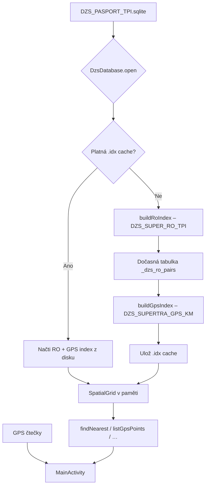

# Indexace DZS databáze – výhybky a GPS

Tento dokument popisuje, jak aplikace **RFID Go GPS** indexuje tabulky `DZS_SUPER_RO_TPI` (výhybky / TUDU) a `DZS_SUPERTRA_GPS_KM` (GPS body), a jak lze index **předpřipravit na PC** a dodat ho spolu s databází, aby se při spuštění aplikace nemuselo znovu skenovat SQLite.

Implementace: `DzsDatabase.java`, `DzsIndexCache.java`.

---

## Přehled

Indexace **neprobíhá v SQLite** (`CREATE INDEX` se nepoužívá). Aplikace při otevření databáze sestaví dva **paměťové indexy** a volitelně je uloží do **diskové cache** (gzip soubor `.idx`).

| Index | Zdrojová tabulka | Klíč | Hodnota |
|-------|------------------|------|---------|
| **RO index** (výhybky) | `DZS_SUPER_RO_TPI` | `SUPER_Z_ID\|SUPER_D_ID` | TUDU kód + číslo výhybky |
| **GPS index** | `DZS_SUPERTRA_GPS_KM` | `SUPER_Z_ID\|SUPER_D_ID` | zeměpisná šířka + délka |

Při běhu aplikace se z GPS indexu ještě sestaví **prostorová mřížka** (`SpatialGrid`) pro rychlé hledání nejbližšího bodu. Ta se **nepersistuje** – vytvoří se vždy z GPS indexu (~1 s), což je zanedbatelné oproti SQL skenu.

---

## Vstupní tabulky a sloupce

Aplikace detekuje názvy sloupců přes `PRAGMA table_info`. Níže jsou primární a záložní kandidáti.

### `DZS_SUPER_RO_TPI`

| Účel | Sloupce (priorita) |
|------|---------------------|
| Spojovací klíč | `SUPER_Z_ID`, `SUPER_D_ID` |
| TUDU | `TUDU`, `TUDU_KOD`, `TUDU_CODE` |
| Číslo výhybky | `COBJEKT` (primární), záložně `VYHYBKA`, `VYH_CISLO`, … |
| Rozsah částí (volitelné) | `CAST_MIN`, `CAST_MAX` |
| Filtr (volitelné) | `POLOHA` |

### `DZS_SUPERTRA_GPS_KM`

| Účel | Sloupce (priorita) |
|------|---------------------|
| Spojovací klíč | `SUPER_Z_ID`, `SUPER_D_ID` |
| Šířka | `LAT`, `LAN`, `LATITUDE`, `GPS_LAT`, `SIRKA`, `Y`, … |
| Délka | `LON`, `LONGITUDE`, `LNG`, `GPS_LON`, `DELKA`, `X`, … |

---

## Postup indexace (krok za krokem)

### Fáze 0 – Otevření databáze

1. Zdrojový soubor (typicky `DZS_PASPORT_TPI.sqlite`) se zkopíruje do cache aplikace, pokud není už v zapisovatelném adresáři.
2. Nastaví se `PRAGMA cache_size = -64000`, `PRAGMA temp_store = MEMORY`.

### Fáze 1 – Kontrola cache

Aplikace hledá soubor:

```
{cacheDir}/dzs_index/dzs_{velikost_hex}_{mtime_hex}.idx
```

**Otisk platnosti** = `velikost souboru` + `lastModified` **zdrojové** databáze (ne kopie v cache aplikace). Díky tomu lze `.idx` připravit na PC a zkopírovat na zařízení.

Pokud cache sedí → načte se RO + GPS index (~sekundy). Jinak pokračuje plná indexace.

### Fáze 2A – RO index (výhybky)

SQL ekvivalent (názvy sloupců se mohou lišit):

```sql
SELECT SUPER_Z_ID, SUPER_D_ID, TUDU,
       COALESCE(
         NULLIF(TRIM(CAST(COBJEKT AS TEXT)), ''),
         NULLIF(TRIM(CAST(VYHYBKA AS TEXT)), '')
       ) AS vyhybka
FROM DZS_SUPER_RO_TPI
WHERE TUDU IS NOT NULL AND TUDU <> ''
  AND vyhybka IS NOT NULL
  -- pokud existuje sloupec POLOHA:
  AND POLOHA IS NOT NULL
  AND TRIM(CAST(POLOHA AS TEXT)) <> ''
  AND UPPER(TRIM(CAST(POLOHA AS TEXT))) <> 'NULL'
```

Pro každý řádek:

- `SUPER_Z_ID` a `SUPER_D_ID` se normalizují (trim, číselné hodnoty → celé číslo bez desetinné části).
- `pairKey = SUPER_Z_ID + "|" + SUPER_D_ID`
- Do mapy: `pairKey → { tudu, vyhybka }`

**Poznámka:** Pokud existuje více řádků se stejným párem ID, **poslední řádek přepíše předchozí** (stejné chování jako `HashMap` v Javě).

### Fáze 2B – GPS index

GPS body se indexují **jen pro páry ID z RO indexu** – nepro celou GPS tabulku.

1. Vytvoří se dočasná tabulka `_dzs_ro_pairs (super_z_id, super_d_id)` se všemi páry z RO indexu.
2. Pro každý pár se vezme **jeden** GPS záznam – ten s nejnižším `rowid` (deduplikace):

```sql
SELECT g.SUPER_Z_ID, g.SUPER_D_ID,
       CAST(REPLACE(g.LAT, ',', '.') AS REAL),
       CAST(REPLACE(g.LON, ',', '.') AS REAL)
FROM DZS_SUPERTRA_GPS_KM g
INNER JOIN (
  SELECT g2.SUPER_Z_ID, g2.SUPER_D_ID, MIN(g2.rowid) AS rid
  FROM DZS_SUPERTRA_GPS_KM g2
  INNER JOIN _dzs_ro_pairs rp
    ON g2.SUPER_Z_ID = rp.super_z_id
   AND g2.SUPER_D_ID = rp.super_d_id
  GROUP BY g2.SUPER_Z_ID, g2.SUPER_D_ID
) agg ON g.rowid = agg.rid
```

3. Pokud CAST výrazy selžou, aplikace zkusí číst souřadnice přímo bez CAST.
4. Poslední záložní postup: `LIMIT 1` dotaz pro každý pár ID zvlášť (pomalé, ale spolehlivé).

Výsledek: seznam `{ pairKey, latitude, longitude }`.

### Fáze 3 – Uložení cache

Index se zapíše do gzip souboru `.idx` (viz formát níže).

### Fáze 4 – Prostorová mřížka (pouze v paměti)

- Velikost buňky: **0,005°** (~500 m)
- Klíč buňky: `(floor(lat/0.005), floor(lon/0.005))`
- Hledání nejbližšího bodu: rozšiřující se kruhy kolem buňky, max. 40 prstenců

---

## Formát souboru `.idx` (verze 4)

Soubor je **gzip** komprimovaný binární stream ve formátu Java `DataOutputStream` (big-endian).

| Pořadí | Typ | Hodnota |
|--------|-----|---------|
| 1 | `int32` | Magic `0x445A5349` (`"DZSI"`) |
| 2 | `int32` | Verze `4` |
| 3 | `int64` | Velikost zdrojové DB v bajtech |
| 4 | `int64` | `lastModified` zdrojové DB (ms od epochy) |
| 5 | `int32` | Počet záznamů RO indexu |
| 6… | opakování | Pro každý RO záznam: |
| | `utf` | `pairKey` (Java modified UTF-8: 2B délka + UTF-8) |
| | `utf` | `tudu` |
| | `int32` | `vyhybka` |
| N | `int32` | Počet GPS záznamů |
| … | opakování | Pro každý GPS záznam: |
| | `utf` | `pairKey` |
| | `float64` | `latitude` |
| | `float64` | `longitude` |

Název souboru:

```
dzs_{db_size_hex}_{db_mtime_hex}.idx
```

Příklad: DB 524 288 000 B, mtime `1719561600000` → `dzs_1f4000000_18ff3c48000.idx`

---

## Předindexace na PC

### Nástroj v repozitáři

```bash
python3 tools/preindex_dzs.py DZS_PASPORT_TPI.sqlite
```

Výstup: `DZS_PASPORT_TPI.sqlite.idx` ve stejné složce (nebo `-o cesta/`).

Volby:

| Přepínač | Význam |
|----------|--------|
| `-o DIR` | Výstupní adresář |
| `--stats` | Vypiš počty záznamů |
| `--verify` | Ověř načtení vygenerovaného souboru |

### Nasazení na zařízení

1. Zkopírujte `DZS_PASPORT_TPI.sqlite` na zařízení (Stažené soubory, kořen úložiště, …).
2. Zkopírujte vygenerovaný `.idx` do cache aplikace:

```
/data/data/com.rfidw.app.gps/cache/dzs_index/dzs_{velikost_hex}_{mtime_hex}.idx
```

**Důležité:** Název `.idx` musí odpovídat **velikosti a času změny** souboru `.sqlite` na zařízení. Pokud soubor na zařízení překopírujete znovu, může se změnit `lastModified` – v tom případě index znovu vygenerujte nebo spusťte nástroj na kopii ze zařízení.

3. Při prvním otevření aplikace uvidíte fázi „Načítám cache indexu“ místo „Indexuji výhybky / GPS body“.

### Ruční ověření otisku

```bash
# velikost
stat -c '%s' DZS_PASPORT_TPI.sqlite

# čas změny (ms) – Linux
stat -c '%Y' DZS_PASPORT_TPI.sqlite | awk '{print $1 * 1000}'

# hex pro název souboru
python3 -c "import os; p='DZS_PASPORT_TPI.sqlite'; print(hex(os.path.getsize(p)), hex(int(os.path.getmtime(p)*1000)))"
```

---

## Použití indexu za běhu

### GPS → TUDU + výhybka (`findNearest`)

1. Z aktuální GPS polohy najde nejbližší bod v GPS indexu (prostorová mřížka + haversine).
2. Z `pairKey` dohledá TUDU a výhybku v RO indexu.
3. Vrátí `GpsMatch` včetně vzdálenosti v metrech.

Volá se z `MainActivity` při pohybu ≥ 5 m nebo ≥ 1 s od posledního hledání.

### Seznam nejbližších TUDU (`findNearestDistinctTudu`)

Plný průchod GPS indexem, pro každý TUDU kód nejlepší bod, seřazeno podle vzdálenosti (max. 10).

### Vzdálenosti výhybek v TUDU (`findVyhybkaDistancesForTudu`)

Dotaz do `DZS_SUPER_RO_TPI` pro daný TUDU. Pokud tabulky obsahují sloupce **KMK_INT** (RO) a **KM_INT** (GPS), spojí se s `DZS_SUPERTRA_GPS_KM` podle `SUPER_Z_ID`, `SUPER_D_ID` a shody kilometrického bodu – výhybky se stejným párem ID, ale jiným číslem, tak dostanou odlišné souřadnice a vzdálenost. Bez těchto sloupců se použije jeden GPS bod na pár ID (záložní režim).

### Ruční výběr TUDU (`loadAllTudu`)

**Nepoužívá** paměťový index – čte přímo z `DZS_SUPER_RO_TPI` včetně `CAST_MIN` / `CAST_MAX`.

---

## Diagram toku



---

## Časté problémy

| Problém | Příčina | Řešení |
|---------|---------|--------|
| Indexace trvá minuty | Velká GPS tabulka, chybí cache | Předindexujte na PC, zkopírujte `.idx` |
| Cache se ignoruje | Jiná velikost/mtime DB na zařízení | Znovu vygenerujte `.idx` pro aktuální soubor |
| Prázdný GPS index | Žádné shody ID mezi tabulkami | Zkontrolujte `SUPER_Z_ID` / `SUPER_D_ID` |
| OOM při indexaci | Příliš velká DB pro RAM zařízení | Předindexace + cache; menší DB |
| Špatné souřadnice | Text s čárkou místo tečky | Aplikace používá `REPLACE(col, ',', '.')` |

---

## Související soubory

| Soubor | Popis |
|--------|-------|
| `app/src/main/java/com/rfidw/app/data/DzsDatabase.java` | Logika indexace a vyhledávání |
| `app/src/main/java/com/rfidw/app/data/DzsIndexCache.java` | Serializace / deserializace `.idx` |
| `tools/preindex_dzs.py` | Předindexace na PC |
| `README.md` | Uživatelská dokumentace aplikace |
