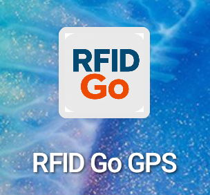
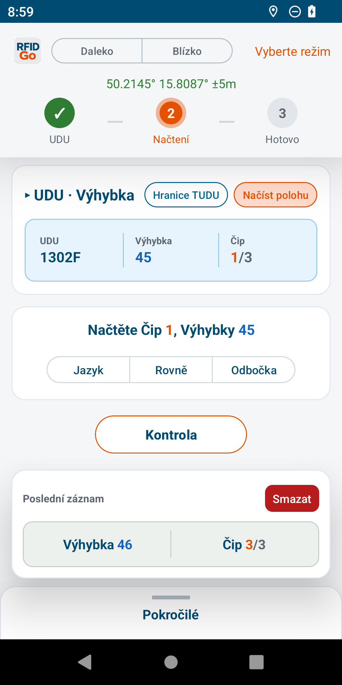
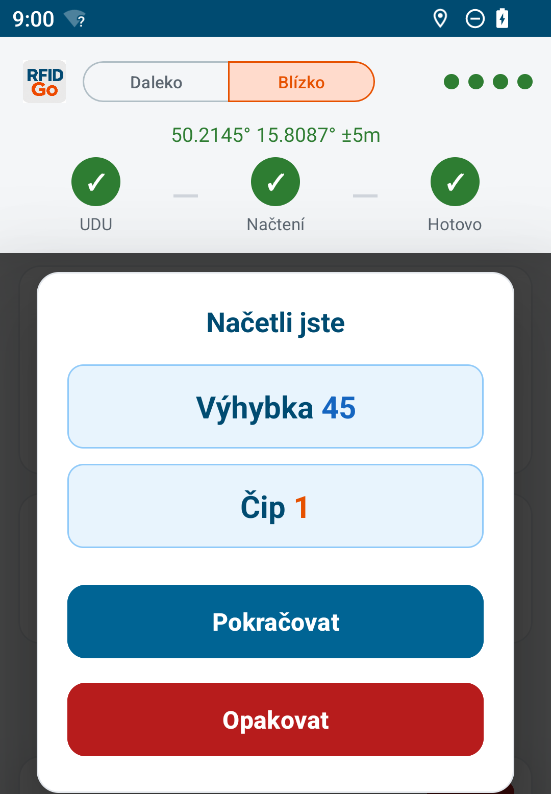
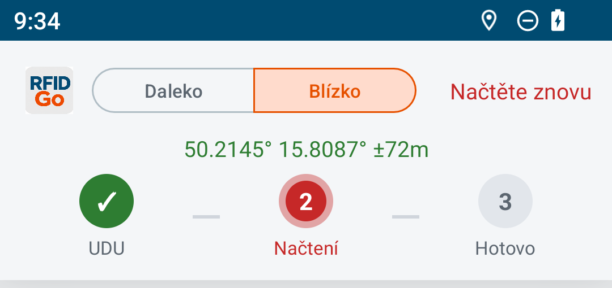
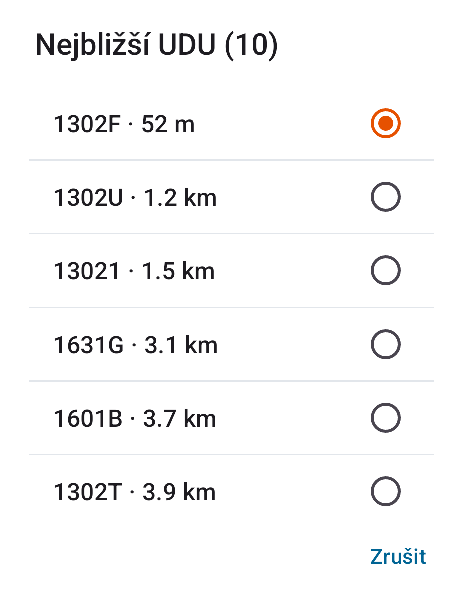
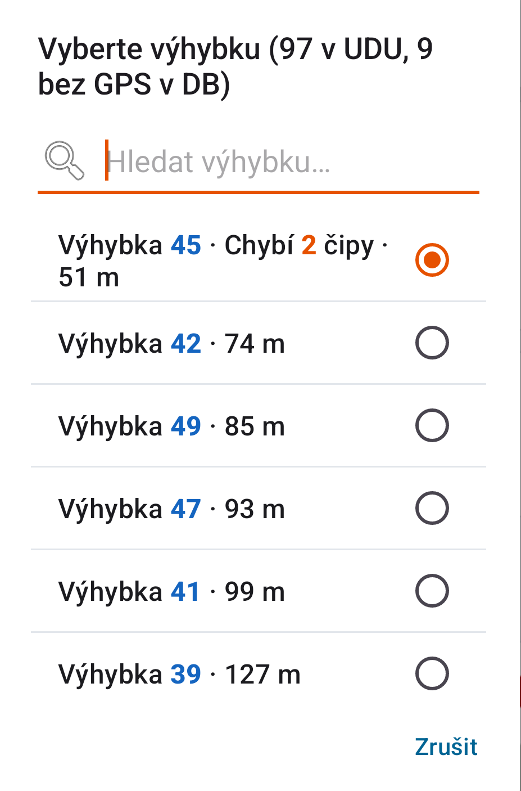
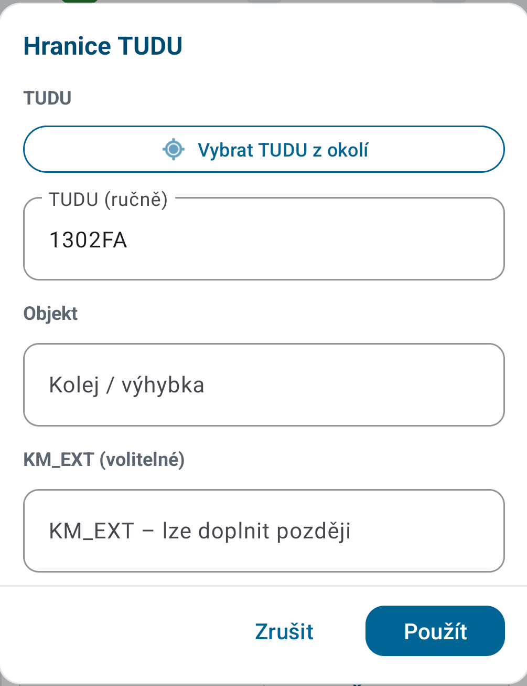
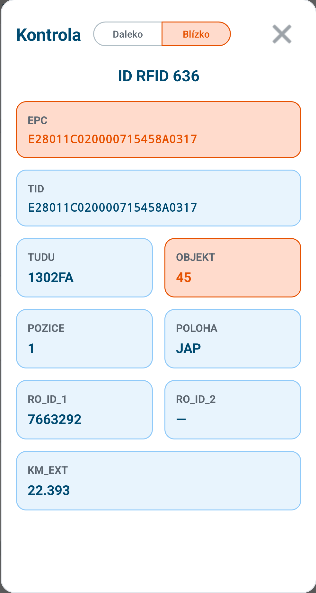

# RFID Go GPS – Příručka pro terén

**Verze aplikace:** 3.160  
**Zařízení:** Chainway C5 (čtečka s GPS)

Technické detaily: `RFID_Go_GPS_prirucka.pdf`.

---

## Obsah

| # | Kapitola |
|---|----------|
| 1 | [Běžný zápis](#1-běžný-zápis) |
| 2 | [Špatné UDU / výhybka](#2-špatné-udu--výhybka) |
| 3 | [Hranice TUDU](#3-hranice-tudu) |
| 4 | [Kontrola](#4-kontrola) |
| 5 | [Když něco nejde](#5-když-něco-nejde) |
| 6 | [Slovníček](#6-slovníček) |

---

## 1. Běžný zápis

1. Zapněte aplikaci → zelené GPS nahoře.
2. V kartě zkontrolujte **UDU**, **výhybku**, **čip**. Špatně → kap. 2.
3. **Daleko** (tag v koleji) nebo **Blízko** (u antény). Bez toho spoušť nefunguje.
4. U 3částové výhybky: **Jazyk** / **Rovně** / **Odbočka**.
5. Spoušť.
6. Dialog **„Načetli jste“** → **Pokračovat** / **Opakovat**.

| → | Prvek |
|---|--------|
| **Daleko** / **Blízko** | výkon – povinné před spouští |
| GPS | zelené = fix |
| Tři kroky | **UDU** → **Načtení** → **Hotovo** (šedá / modrá / zelená / oranžová / červená) |
| Karta | UDU, výhybka, čip |
| Uprostřed | nápověda čipu; **Jazyk** / **Rovně** / **Odbočka** |
| **Kontrola** | ověření bez zápisu → kap. 4 |
| **Hranice TUDU** | → kap. 3 |

### Úspěch

Zápis platí jen s dialogem **„Načetli jste“**.

| → | Prvek |
|---|--------|
| Zelené fajfky | hotovo |
| **Pokračovat** | další čip |
| **Opakovat** | stejný čip znovu |

### Neúspěch

| → | Prvek |
|---|--------|
| **Načtěte znovu** + červené **Načtení** | selhalo |
| Co dělat | znovu přiložit, Daleko ↔ Blízko, jiná strana tagu |

---

## 2. Špatné UDU / výhybka

Klepněte v kartě na UDU nebo výhybku.  
Po ruční změně GPS nepřepíná, dokud neklepnete **Načíst polohu**.

| → | Prvek |
|---|--------|
| Seznam | 10 nejbližších UDU (podle vzdálenosti) |
| Oranžové kolečko | výběr |
| **Zrušit** | zavřít |

| → | Prvek |
|---|--------|
| Hledat… | filtr |
| Vzdálenost | u položky |
| **Chybí N čipů** | nedokončená |
| Zašedlé | hotové – nejdou vybrat |

3částová = Jazyk/Rovně/Odbočka · 4částová = části z DB. Aplikace nastaví první chybějící čip.

---

## 3. Hranice TUDU

Zápis na hranici dvou úseků (ne výhybka 1–4).

1. **Hranice TUDU** v kartě.
2. Vyplnit → **Použít**.
3. Daleko/Blízko → spoušť.
4. Po zápisu režim skončí.

| → | Prvek |
|---|--------|
| **Vybrat TUDU z okolí** | podle GPS |
| **TUDU (ručně)** | ruční kód |
| **Objekt** | kolej / výhybka |
| **KM_EXT** | volitelné |
| **Použít** | potvrdit |

Ukončení dřív: změna UDU/výhybky, nebo **Načíst polohu**.

---

## 4. Kontrola

Ověření už zapsaného tagu – **nic se nezapisuje**.

1. Daleko nebo Blízko.
2. Spoušť.

| → | Prvek |
|---|--------|
| **EPC** / **TID** | z tagu |
| **TUDU**, **OBJEKT**, … | z CSV |
| ✕ | zavřít |

Mimo CSV → **„Tag není v CSV“**. Více shod → šipky.

---

## 5. Když něco nejde

| Problém | Řešení |
|---------|--------|
| Spoušť nic / Načtení oranžové | Daleko nebo Blízko |
| Načtení červené / Načtěte znovu | znovu, Daleko ↔ Blízko, jiná strana tagu |
| GPS nejde | volné místo / Testovací režim GPS |
| Špatná výhybka | kap. 2 |
| Chyba po zápisu | **Smazat** u posledního záznamu → znovu |

---

## 6. Slovníček

| Pojem | Význam |
|-------|--------|
| **UDU / TUDU** | úsek tratě |
| **Výhybka** | číslo výhybky |
| **Čip** | část výhybky |
| **Daleko / Blízko** | výkon čtečky |
| **Hranice TUDU** | zápis na hranici úseků |
| **Kontrola** | čtení bez zápisu |
| **CSV** | tabulka záznamů (Stažené soubory) |

---

*RFID Go GPS 3.160 – příručka pro terén. Kompletní dokumentace: `RFID_Go_GPS_prirucka.pdf`.*
