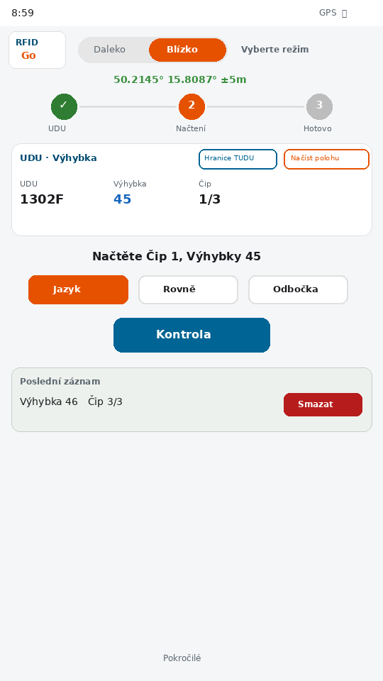
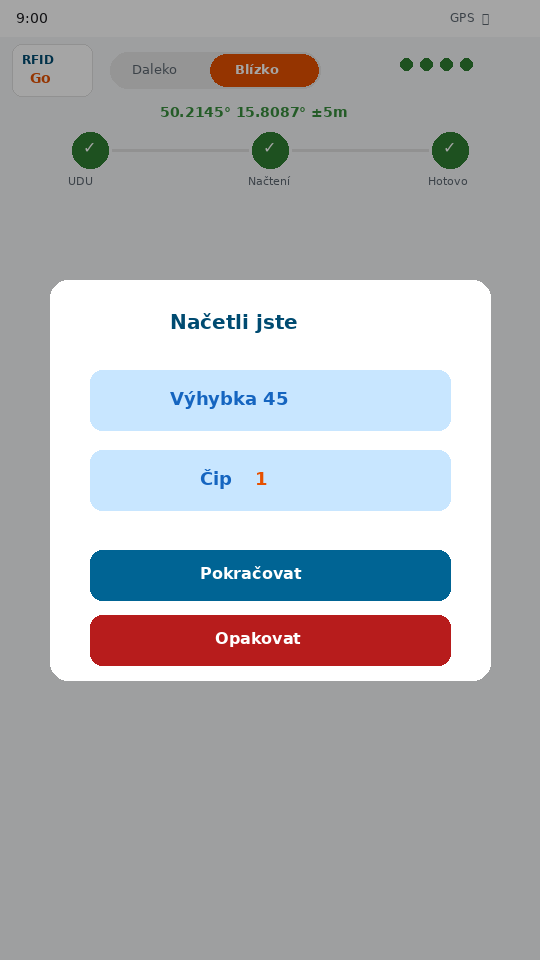
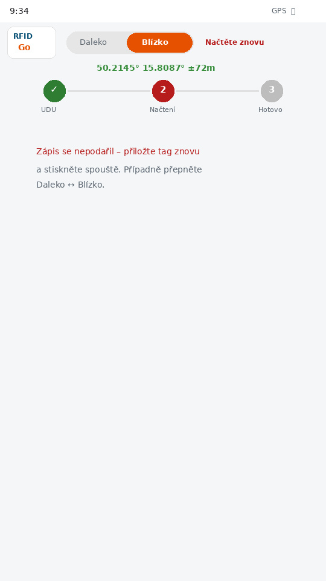
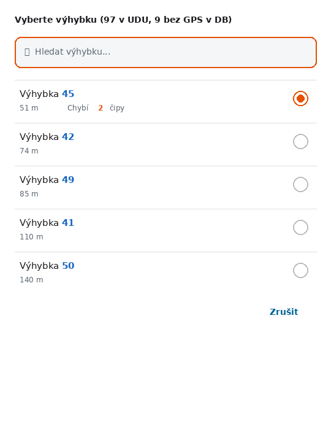
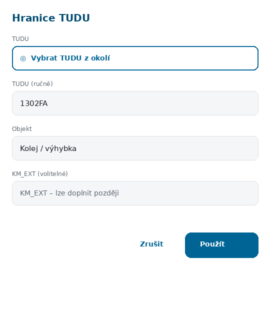
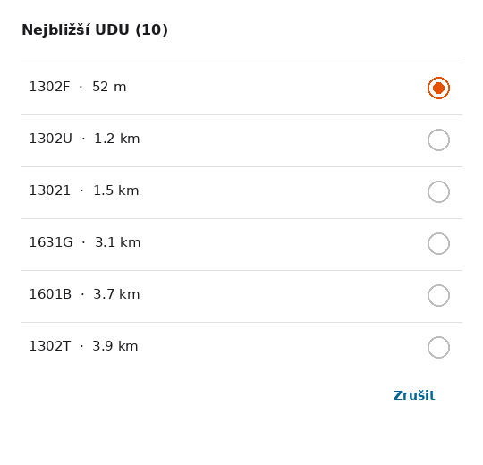
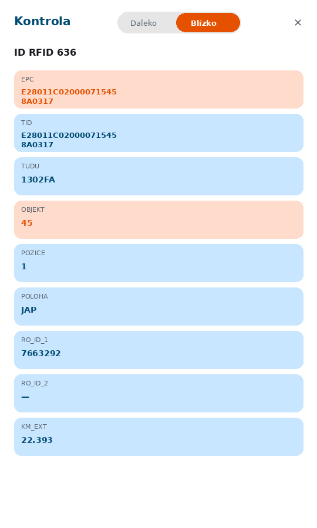

# RFID Go GPS – Příručka pro terén

**Verze aplikace:** 3.158  
**Zařízení:** Chainway C5 (čtečka s GPS)

Každodenní práce v terénu. Technické detaily (CSV, Pokročilé): `RFID_Go_GPS_prirucka.pdf`.

---

## Obsah

| # | Kapitola | Kdy číst |
|---|----------|----------|
| 1 | [Obrazovka](#1-obrazovka) | před první směnou |
| 2 | [Příprava](#2-příprava) | každý start |
| 3 | [Jeden tag](#3-jeden-tag) | hlavní práce |
| 4 | [Barvy](#4-barvy) | když indikátor bliká |
| 5 | [Výhybky a čipy](#5-výhybky-a-čipy) | špatný / jiný výběr |
| 6 | [Hranice TUDU](#6-hranice-tudu) | zápis na hranici úseku |
| 7 | [Kontrola](#7-kontrola) | ověření zapsaného tagu |
| 8 | [Když něco nejde](#8-když-něco-nejde) | problém |
| 9 | [Slovníček](#9-slovníček) | pojmy |

---

## 1. Obrazovka

Aplikace podle GPS najde **úsek** a **výhybku**, zapíše tag a uloží záznam včetně polohy čtečky.

| Oblast | Co tam je |
|--------|-----------|
| Horní lišta | Logo, **Daleko** / **Blízko**, stav, GPS |
| Tři kroky | **UDU** → **Načtení** → **Hotovo** |
| Čtyři tečky | průběh zápisu (tag → uložení → heslo → zamčení) |
| Karta UDU · výhybka | úsek, výhybka, čip, **Hranice TUDU**, **Načíst polohu** |
| Nápověda uprostřed | který čip načítáte + **Jazyk** / **Rovně** / **Odbočka** |
| Poslední záznam | naposledy zapsané; **Smazat** vrátí předchozí stav |

---

## 2. Příprava

1. Zapněte aplikaci a počkejte na **GPS** (souřadnice v horní liště).
2. Aplikace načte databázi a doplní **UDU** a **výhybku**.
3. Zkontrolujte, že náhled sedí s tím, kde stojíte.

> **Bez GPS?** Volné místo, nebo v kartě UDU **Testovací režim GPS** a poloha ze seznamu.

---

## 3. Jeden tag

Před spouští **vždy** zvolte výkon:

| Tlačítko | Kdy |
|----------|-----|
| **Daleko** | Tag v koleji, čtečka dál (vyšší výkon) |
| **Blízko** | Tag u antény v ruce (nízký výkon) |

Bez výběru spouště nefunguje (krok **Načtení** oranžový).

1. Zkontrolujte výhybku v náhledu.
2. Zvolte **Daleko** nebo **Blízko**.
3. U 3částové výhybky zvolte **Jazyk**, **Rovně** nebo **Odbočka**.
4. Přiložte tag a stiskněte **spouště**.
5. Po dialogu **„Načetli jste“** → **Pokračovat** (další čip) nebo **Opakovat** (stejný čip).

Zápis je hotový **jen** když se objeví dialog „Načetli jste“. Jinak viz [kapitolu 8](#8-když-něco-nejde).

---

## 4. Barvy

Stejné barvy u tří kroků nahoře i u čtyř teček pod stavem:

| Barva | Význam |
|-------|--------|
| Šedá | Ještě neproběhlo |
| Modrá | Probíhá |
| Zelená ✓ | Hotovo |
| Oranžová | Něco chybí (typicky **Daleko** / **Blízko**) |
| Červená | Chyba – zkuste znovu |

---

## 5. Výhybky a čipy

- **GPS** sám nabídne nejbližší výhybku.
- **Ručně:** klepněte na náhled a vyberte ze seznamu (vzdálenost + kolik čipů chybí). Kompletní jsou **zašedlé**.
- Po ruční změně se GPS nepřepíná, dokud nekliknete **Načíst polohu**.
- Mezi nedokončenými výhybkami můžete přepínat kdykoli – zapsané čipy si aplikace pamatuje.

| Typ | Čipy | Části |
|-----|------|-------|
| 3částová | 3 | Jazyk, Rovně, Odbočka (volba u každého) |
| 4částová | 4 | Podle databáze (CA/CB, CG/CH, …) |

Aplikace nastaví **první chybějící čip**; nápověda je uprostřed obrazovky.

---

## 6. Hranice TUDU

Speciální zápis **na hranici dvou úseků** (ne běžná výhybka s čipy 1–4).

1. V kartě UDU · výhybka → **Hranice TUDU**.
2. Vyplňte a potvrďte **Použít**:

| Pole | Co napsat |
|------|-----------|
| **TUDU** | Kód úseku – ručně, nebo **Vybrat TUDU z okolí** |
| **Objekt** | Číslo koleje nebo výhybky (např. `12`, `5A`) |
| Kilometrická poloha | Volitelné |

3. Zápis stejně jako v [kapitole 3](#3-jeden-tag) (**Daleko** / **Blízko** → spouště).
4. Po zápisu režim sám skončí a aplikace najde další výhybku.

**Režim poznáte** podle nápisu **Režim hranice TUDU** a objektu místo výhybky.  
**Ukončení dřív:** ruční změna úseku/výhybky, nebo **Načíst polohu**.

---

## 7. Kontrola

Tlačítko **Kontrola** ověří již zapsaný tag – **nic se nezapisuje**.

1. Zvolte **Daleko** nebo **Blízko**.
2. Načtěte tag spouštěm.
3. Zkontrolujte údaje (oranžové řádky zvýrazňují důležité hodnoty).

---

## 8. Když něco nejde

| Problém | Co zkusit |
|---------|-----------|
| Spouště nic nedělá / Načtení oranžové | **Daleko** nebo **Blízko** |
| Načtení červené / dialog se neobjevil | Přiložit znovu, přepnout Daleko ↔ Blízko, jiná strana tagu |
| GPS nefunguje | Volné místo, nebo **Testovací režim GPS** |
| Špatná výhybka | Náhled → ruční výběr |
| Chyba po zápisu | **Pokročilé** → smazat poslední záznam → znovu |

---

## 9. Slovníček

| Pojem | Význam |
|-------|--------|
| **UDU / TUDU** | Kód úseku tratě |
| **Výhybka** | Číslo výhybky (např. 10A) |
| **Čip** | Část výhybky – jazyk, rovně nebo odbočka |
| **Daleko / Blízko** | Výkon čtečky (v koleji / v ruce) |
| **Hranice TUDU** | Zápis na hranici dvou úseků |
| **CSV** | Tabulka záznamů (Stažené soubory) |

---

*Příručka pro terén – RFID Go GPS verze 3.158. Kompletní dokumentace: `RFID_Go_GPS_prirucka.pdf`.*
