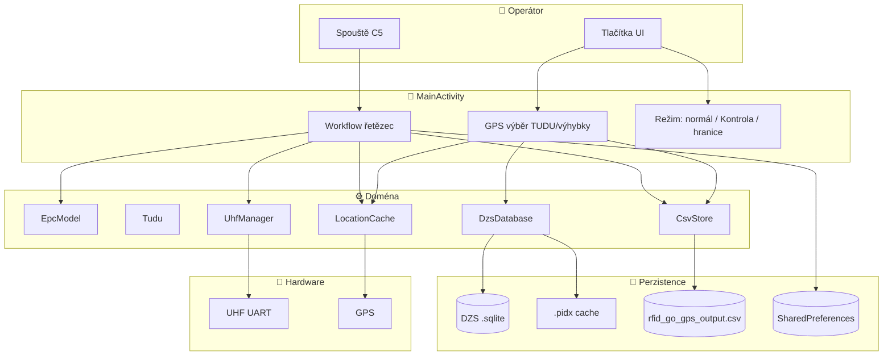
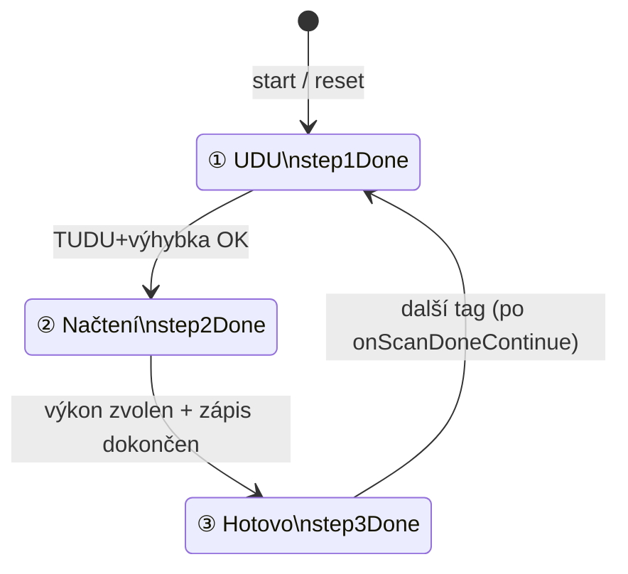
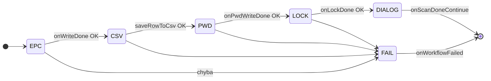
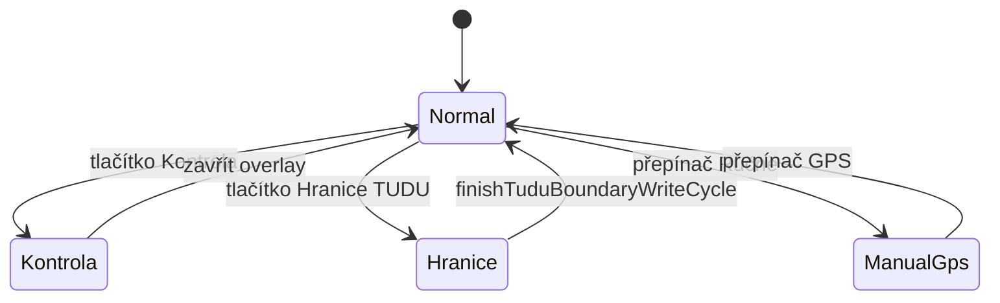
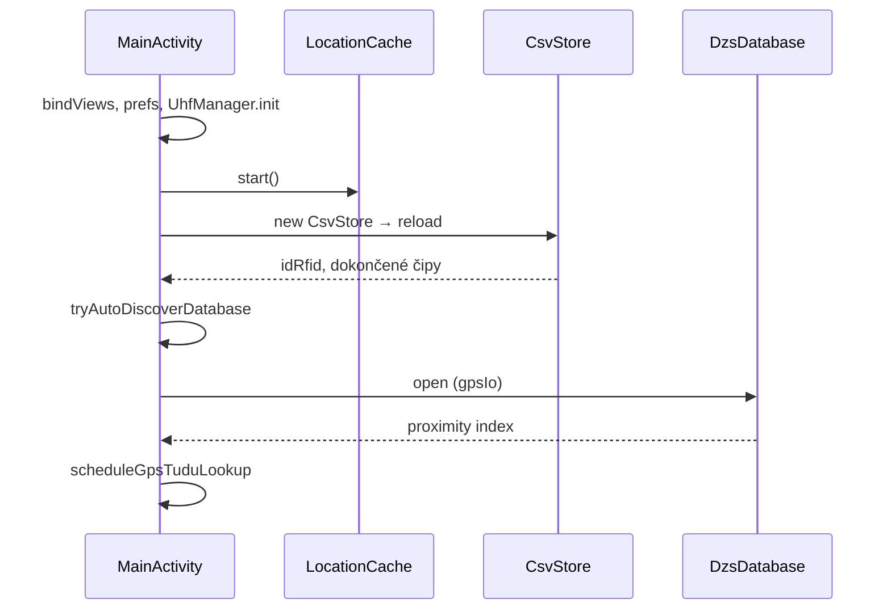
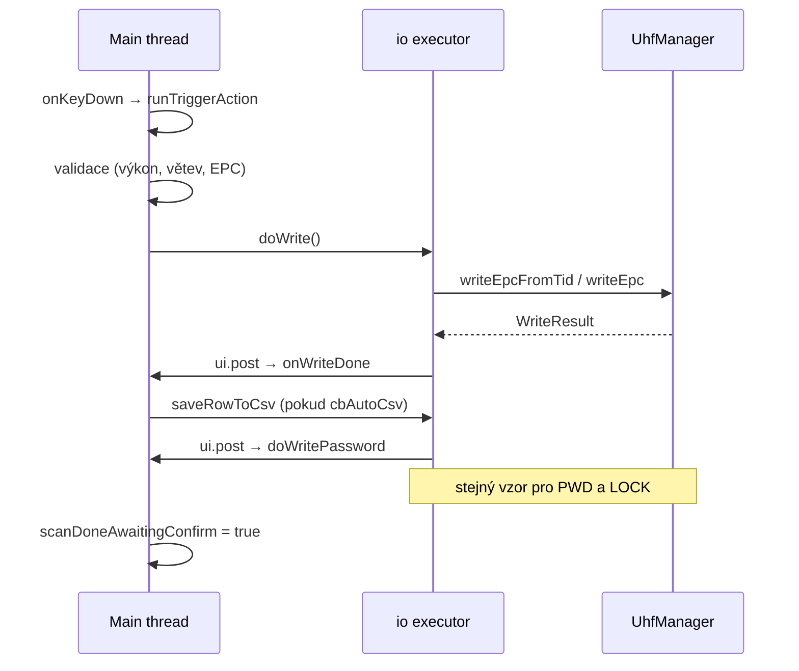
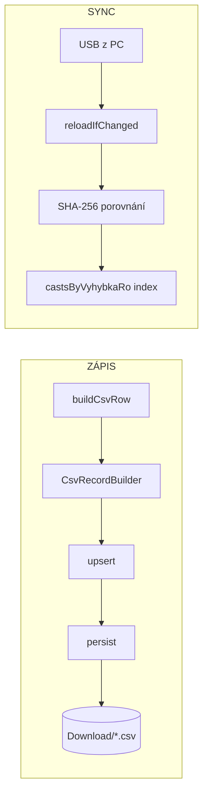

# RFID Go GPS – Technická příručka pro vývojáře

**Verze aplikace:** 3.153  
**Package:** `com.rfidw.app` · `applicationId` `com.rfidw.app.gps`  
**Zařízení:** Chainway C5 (UHF UART, RSCJA SDK)

---

## Obsah

| # | Kapitola | Kdy číst |
|---|----------|----------|
| 0 | [Jak číst tuto příručku](#0-jak-číst-tuto-příručku) | vždy jako první |
| 1 | [Velký obraz – co aplikace dělá](#1-velký-obraz--co-aplikace-dělá) | orientace v kódu |
| 2 | [Stavové automaty](#2-stavové-automaty) | debug workflow / UI kroků |
| 3 | [Datové toky podle scénáře](#3-datové-toky-podle-scénáře) | konkrétní tok dat |
| 4 | [Režimy aplikace](#4-režimy-aplikace) | Kontrola, hranice, ruční GPS |
| 5 | [Karty tříd](#5-karty-tříd) | API jednotlivých modulů |
| 6 | [MainActivity – stav a metody](#6-mainactivity--stav-a-metody) | navigace v orchestrátoru |
| 7 | [Kde hledat při problému](#7-kde-hledat-při-problému) | ladění |
| A | [Příloha: Cheat sheet](#příloha-cheat-sheet) | rychlá reference |

> **Mermaid** = GitHub / IDE (barevné diagramy). **Tabulka + ASCII** pod ním = stejný význam, funguje i v PDF.

---

## 0. Jak číst tuto příručku

### 0.1 Tři úrovně hloubky

```
ÚROVEŇ 1 – Orientace (15 min)
  └─ kapitoly 1 + 2 + Příloha

ÚROVEŇ 2 – Konkrétní tok (30 min)
  └─ kapitola 3 (vyber scénář) + kapitola 4

ÚROVEŇ 3 – Implementace (podle potřeby)
  └─ kapitoly 5 + 6 + 7
```

### 0.2 Kam jít podle otázky

| Ptám se… | Kapitola |
|----------|----------|
| Co se stane po stisku spouště? | [3.2](#32-zápis-tagu--swimlane-podle-vláken) + [2.2](#22-pod-workflow-zápisu-4-kroky) |
| Jak se vybere výhybka z GPS? | [3.3](#33-gps--výběr-výhybky) + [5.4 DzsDatabase](#54-dzsdatabase) |
| Jak funguje cache `.pidx`? | [3.4](#34-dzs-databáze) + [5.5 DzsIndexCache](#55-dzsindexcache) |
| Proč se CSV nepřepisuje z PC? | [3.5](#35-csv) + [7](#7-kde-hledat-při-problému) |
| Jak se skládá EPC? | [5.1 EpcModel](#51-epcmodel) + Příloha |
| Co dělá `wfStepStates`? | [2.2](#22-pod-workflow-zápisu-4-kroky) |
| Jak funguje Kontrola / hranice TUDU? | [4](#4-režimy-aplikace) |

---

## 1. Velký obraz – co aplikace dělá

### 1.1 Jedna věta

Aplikace **určí kontext výhybky** (GPS + DZS DB + CSV), **zapíše UHF tag** (EPC, heslo, lock) a **uloží řádek CSV** včetně GPS polohy čtečky.

### 1.2 Mapa systému (vše na jedné stránce)



**ASCII ekvivalent (PDF):**

```
  Operátor                MainActivity              Doména                 Úložiště
  ────────                ────────────              ──────                 ────────
  spouště ──────────────► workflow ───────────────► UhfManager ─────────► UHF čip
  tlačítka ─────────────► GPS výběr ──────────────► DzsDatabase ────────► .sqlite + .pidx
                          režimy ──────────────────► CsvStore ───────────► CSV + prefs
                                                   └► LocationCache ─────► GPS
                                                   └► EpcModel (výpočet EPC)
```

### 1.3 Tři vrstvy a vlákna

| Vrstva | Komponenty | Vlákno |
|--------|------------|--------|
| **UI** | `MainActivity`, XML layouty | main + `ui` Handler |
| **Logika** | `EpcModel`, `Tudu`, `DzsDatabase`, `CsvStore`, `UhfManager`, `LocationCache` | voláno z `io` / `gpsIo` |
| **I/O** | SQLite, CSV soubor, UHF SDK, GPS provider | `io` (RFID, CSV), `gpsIo` (DB) |

**Pravidlo:** RFID zápis a SQLite **nikdy** na main thread (kromě `UhfManager.init()` při startu).

---

## 2. Stavové automaty

Stavy vysvětlují, **proč** UI v daném okamžiku něco blokuje nebo čeká.

### 2.1 Hlavní kroky UI (karty nahoře)



| Krok | Flag | Splněno když |
|------|------|--------------|
| ① UDU | `step1Done` | TUDU + výhybka, nebo vyplněná hranice TUDU |
| ② Načtení | `step2Done` | preset výkonu (`activePowerPresetInKoleji != null`) |
| ③ Hotovo | `step3Done` | úspěšné zamčení v řetězci |

### 2.2 Pod-workflow zápisu (4 kroky)



| Index | Konstanta | Akce | Callback |
|:-----:|-----------|------|----------|
| 0 | `WF_STEP_EPC` | `doWrite()` → TID→EPC nebo šablona | `onWriteDone` |
| 1 | `WF_STEP_CSV` | `saveRowToCsv()` | → `doWritePassword` |
| 2 | `WF_STEP_PWD` | `doWritePassword()` | `onPwdWriteDone` |
| 3 | `WF_STEP_LOCK` | `doLock()` | `onLockDone` |

Každý krok má stav v `wfStepStates[i]`: `PENDING(0)` → `ACTIVE(1)` → `OK(2)` / `FAIL(3)`.

**Globální příznaky řetězce:**

| Příznak | Význam |
|---------|--------|
| `chainWorkflow` | spouště spustilo celý řetězec |
| `workflowRunning` | právě probíhá zápis |
| `scanDoneAwaitingConfirm` | LOCK OK, čeká dialog „Načetli jste“ |

### 2.3 Režim aplikace (vzájemně se vylučují)



| Režim | Příznak | Spouště dělá |
|-------|---------|--------------|
| **Normál** | vše false | řetězec zápisu |
| **Kontrola** | `kontrolaActive` | jen `readSingle()` |
| **Hranice TUDU** | `tuduBoundaryMode`, `cast=5` | zápis s ručním objektem/KM_EXT |
| **Ruční GPS** | `tuduModeGps=false` | bez auto lookup; picker dialog |

---

## 3. Datové toky podle scénáře

### 3.1 Start aplikace (`onCreate`)



| Pořadí | Co | Kde v kódu |
|:------:|-----|------------|
| 1 | UI + prefs | `onCreate`, `bindViews` |
| 2 | GPS start | `LocationCache.start()` |
| 3 | CSV load | `new CsvStore` → `applyReloadedCsvState` |
| 4 | Auto DB | `tryAutoDiscoverDatabase` → Download/`DZS_PASPORT_TPI.sqlite` |
| 5 | Index DZS | `loadDatabaseFromPath` na `gpsIo` |
| 6 | První lookup | `scheduleGpsTuduLookup` |

---

### 3.2 Zápis tagu – swimlane podle vláken



| Fáze | Main thread | `io` executor |
|------|-------------|---------------|
| Trigger | `onKeyDown`, `runTriggerAction`, validace | — |
| EPC | `doWrite` spustí | `uhf.writeEpcFromTid()` |
| Callback | `onWriteDone` | — |
| CSV | rozhodnutí | `csvStore.upsertAndPersist` |
| Heslo | `doWritePassword` → callback | `uhf.writeAccessPassword` |
| Lock | `doLock` → callback | `uhf.lockTag` |
| Konec | dialog, `onScanDoneContinue` | — |

**Vstupy do CSV řádku:** `EpcModel` + `LocationCache.getSnapshot()` + RO větve z `Tudu` + `CsvRecordBuilder.build`.

---

### 3.3 GPS → výběr výhybky


| Konstanta | Hodnota | Význam |
|-----------|---------|--------|
| `GPS_LOOKUP_MIN_MOVE_M` | 5 m | min. pohyb pro nový lookup |
| `GPS_LOOKUP_MIN_INTERVAL_MS` | 1000 | throttle |
| `PROXIMITY_BBOX_DEG` | 0,04 | ~4 km okolí |
| `PROXIMITY_RELOAD_MOVE_KM` | 3 km | reindexace při odjezdu |

---

### 3.4 DZS databáze

```
  DZS_PASPORT_TPI.sqlite
           │
           ▼ kopie do files/dzs/
           │
     ┌─────┴─────┐
     │ SHA-256   │◄── hash2_*.txt sidecar
     └─────┬─────┘
           ▼
  proximity index (bbox kolem GPS)
           │
     ┌─────┴──────────────┐
     ▼                    ▼
 roByPairKey         VyhybkaGpsStore
 (TUDU, RO, POLOHA)  (lat/lon body)
     │                    │
     └────────┬───────────┘
              ▼
        SpatialGrid → GpsMatch
```

**Tabulky SQLite:**

| Tabulka | Klíčová data |
|---------|--------------|
| `DZS_SUPER_RO_TPI` | TUDU, výhybka, POLOHA, RO_ID, OD, DO |
| `DZS_SUPERTRA_GPS_KM` | LAT, LON, KM_EXT, SUPER_Z/D_ID |

---

### 3.5 CSV



| Index v paměti | Klíč | Hodnota |
|----------------|------|---------|
| Řádky | `ID_RFID` | `CsvStore.Row` |
| Dokončené čipy | `TUDU\0výhybka\0roId` | `Set<Integer>` castů |

---

### 3.6 Spouště – rozhodovací strom

```
                    onKeyDown (trigger)
                           │
              ┌────────────┼────────────┐
              ▼            ▼            ▼
        kontrolaActive   scanDone    delete dialog
              │          Confirm?         │
              ▼            │              ▼
      runKontrolaRead     │          ignorovat
              │            ▼
              │     onScanDoneContinue
              │            │
              └────────────┼────────────┐
                           ▼            │
                   runTriggerAction     │
                           │            │
                           ▼            ▼
                    řetězec EPC→CSV→PWD→LOCK
```

---

## 4. Režimy aplikace

| | **Normál** | **Kontrola** | **Hranice TUDU** | **Ruční GPS** |
|---|:---:|:---:|:---:|:---:|
| Zápis tagu | ✓ | ✗ | ✓ (čip 5) | ✓ |
| GPS auto-výběr | ✓ | — | ✗ | ✗ |
| Čte z CSV | pro stav | ✓ porovnání | — | pro stav |
| `epc.cast` | 1–4 | — | **5** | 1–4 |
| POLOHA v CSV | z DB | — | prázdná | z DB |
| Klíčové metody | `runTriggerAction` | `runKontrolaRead` | `showTuduBoundaryForm` | `showTuduPicker` |

---

## 5. Karty tříd

Každá karta: **vstup → zpracování → výstup → klíčové metody**.

### 5.1 EpcModel

| | |
|---|---|
| **Soubor** | `epc/EpcModel.java` |
| **Vstup** | `year`, `tudu`, `vyhybka`, `cast`, `idRfid` |
| **Výstup** | 24 hex znaků EPC |
| **Metody** | `buildEpc()`, `decode()`, `isValid()` |
| **Poznámka** | čistá Java – testovatelná na JVM |

**Layout EPC:**

```
┌──────┬──────┬───┬───┬─────┬──┬──────────┐
│ ROK  │TUDU  │T5 │T6 │ VÝH │Č │ ID_RFID  │
│  4   │ 1-4  │ 2 │ 2 │  3  │1 │    8     │
└──────┴──────┴───┴───┴─────┴──┴──────────┘
 Příklad: 202615014A01010100030001
```

### 5.2 Tudu

| | |
|---|---|
| **Soubor** | `data/Tudu.java` |
| **Vstup** | řádky z DZS (`POLOHA`, `RO_ID`, OD/DO) |
| **Výstup** | hierarchie TUDU → Výhybka → RoBranch |
| **Metody** | `uduCode()`, `findOrCreate()`, `resolvedCastMax()`, `fourPartFamily()` |

| POLOHA | Typ | Čipy |
|--------|-----|------|
| `J*` | 3částová | 1–3 |
| `C*` | 4částová | 1–4 |

### 5.3 UhfManager

| | |
|---|---|
| **Soubor** | `rfid/UhfManager.java` |
| **Vstup** | access pwd, EPC 24 hex / TID |
| **Výstup** | `WriteResult` (success, tid, preset used) |
| **Metody** | `writeEpcFromTid()`, `writeAccessPassword()`, `lockTag()`, `readSingle()` |

| Banka | ptr | len | Účel |
|-------|-----|-----|------|
| EPC (1) | 2 | 6 | 24 hex |
| RESERVED (0) | 2 | 2 | access heslo |

Preset fallback: `11223344`, `11112222`, `12345678`. Lock: `008020`.

### 5.4 DzsDatabase

| | |
|---|---|
| **Soubor** | `data/DzsDatabase.java` (~1580 ř.) |
| **Vstup** | cesta SQLite + GPS lat/lon |
| **Výstup** | `GpsMatch`, `List<Tudu>`, RO větve |
| **Metody** | `open()`, `ensureProximityLoaded()`, `findNearest*()`, `loadAllTudu()` |

### 5.5 DzsIndexCache

| | |
|---|---|
| **Soubor** | `data/DzsIndexCache.java` (package-private) |
| **Vstup** | proximity index z paměti |
| **Výstup** | soubor `.pidx` v21 (gzip) |
| **Metody** | `tryLoadProximity()`, `saveProximity()`, `resolveContentHash()` |

### 5.6 CsvStore / CsvStorage / CsvRecordBuilder

| Třída | Role |
|-------|------|
| `CsvStore` | in-memory tabulka, index čipů, legacy migrace |
| `CsvStorage` | cesta Download/, MediaStore Android 10+ |
| `CsvRecordBuilder` | factory řádku – odděleno od EpcModel |

### 5.7 LocationCache

| | |
|---|---|
| **Interval GPS** | 500 ms |
| **Stale** | 30 s |
| **API** | `getSnapshot()`, `setTestOverride()`, `formatStatusText()` |

### 5.8 KmExtResolver

`fromOdDoKmRef(od, do, kmRef)` → `chip1` = KM_REF, `other` = druhý konec tratě.

---

## 6. MainActivity – stav a metody

### 6.1 Důležité instance proměnné (seskupeno)

| Skupina | Proměnné | Účel |
|---------|----------|------|
| **Kroky UI** | `step1Done`, `step2Done`, `step3Done` | indikátor nahoře |
| **Workflow** | `chainWorkflow`, `workflowRunning`, `wfStepStates[]`, `scanDoneAwaitingConfirm` | řetězec zápisu |
| **GPS** | `gpsAutoSelection`, `gpsTuduLocked`, `gpsVyhybkaLocked`, `gpsTestMode` | auto-výběr / zámky |
| **Režimy** | `kontrolaActive`, `tuduBoundaryMode`, `epcTemplateMode` | odbočky |
| **Kontext zápisu** | `epc` (EpcModel), `currentTudu`, `currentVyhybka`, `castPartType` | co se zapisuje |
| **Data** | `csvStore`, `dzsDatabase`, `uhf`, `locationCache` | služby |

### 6.2 Mapa metod podle úkolu

| Úkol | Metody |
|------|--------|
| Start | `onCreate`, `tryAutoDiscoverDatabase`, `loadDatabaseFromPath` |
| GPS | `scheduleGpsTuduLookup`, `applyGpsMatch`, `refreshGpsAtWorkflowStart` |
| Zápis | `runTriggerAction`, `doWrite`, `doWritePassword`, `doLock` |
| Po zápisu | `onWriteDone`, `onLockDone`, `onTagCycleComplete`, `onScanDoneContinue` |
| CSV | `saveRowToCsv`, `buildCsvRow`, `reloadCsvIfChanged`, `firstMissingCast` |
| Pickery | `showTuduPicker`, `showVyhybkaPicker`, `showNearbyTuduPicker` |
| Kontrola | `showKontrolaOverlay`, `runKontrolaRead` |
| Hranice | `showTuduBoundaryForm`, `finishTuduBoundaryWriteCycle` |
| Trigger | `onKeyDown` |

---

## 7. Kde hledat při problému

| Symptom | Pravděpodobná příčina | Kde v kódu |
|---------|----------------------|------------|
| Spouště nic nedělá | chybí výkon / větev u 3částové | `runTriggerAction`, `requirePowerPreset`, `requireCastBranchSelection` |
| Špatná výhybka | stale GPS / zámek / cache | `applyGpsMatch`, `gpsVyhybkaLocked`, `.pidx` |
| DB se dlouho načítá | první index okolí | `DzsDatabase.open`, `ensureProximityLoaded` |
| CSV se neaktualizuje z PC | hash se nezměnil / MediaStore | `reloadIfChanged`, `CsvStorage` |
| Zápis EPC selže | špatné heslo tagu | `UhfManager.writeDataWithPresetFallback` |
| Tag zamčen, nelze přepsat | lock z předchozího zápisu | `lockTag`, preset hesla |
| Po zápisu se neposune čip | `scanDoneAwaitingConfirm` | `onScanDoneContinue` |
| Hranice TUDU špatná data | `tuduBoundaryMode` | `saveTuduBoundaryRowToCsv` |

---

## Příloha: Cheat sheet

### Struktura balíčků

```
com.rfidw.app/
  ui/MainActivity.java      ← orchestrátor
  epc/EpcModel.java
  data/{Tudu,DzsDatabase,DzsIndexCache,VyhybkaGpsStore}
  csv/{CsvStore,CsvStorage,CsvRecordBuilder}
  rfid/UhfManager.java
  location/LocationCache.java
  kmext/KmExtResolver.java
```

### SharedPreferences `rfidgogps`

`idRfid` · `epcTemplateMode` · `tuduModeGps` · `gpsTestMode` · `testLat/Lon` · `dbSourcePath/Uri/DisplayName`

### Trigger keys

`139, 280, 293, 311, 312, 522, 523, 0x3E8`

### Výkon

V koleji **16 dBm** · V ruce **1 dBm**

### CSV sloupce

`ID_RFID;EPC;TID;TUDU;OBJEKT;POZICE;POLOHA;RO_ID_1;RO_ID_2;KM_EXT;LAT;LON;ACCURACY_M;GPS DATE`

### Build

```bash
./gradlew assembleRelease   # → rfid_go_gps_<verze>.apk
python3 docs/generate_prirucka_vyvojare.py   # → PDF této příručky
```

### Související docs

| Dokument | Účel |
|----------|------|
| `prirucka-teren.md` | terén |
| `prirucka-uzivatele.md` | uživatel |
| `INDEXACE_DZS.md` | DZS detail (část zastaralá) |
| `AGENTS.md` | build v Cursor Cloud |

---

*RFID Go GPS 3.153 – technická příručka pro vývojáře*
