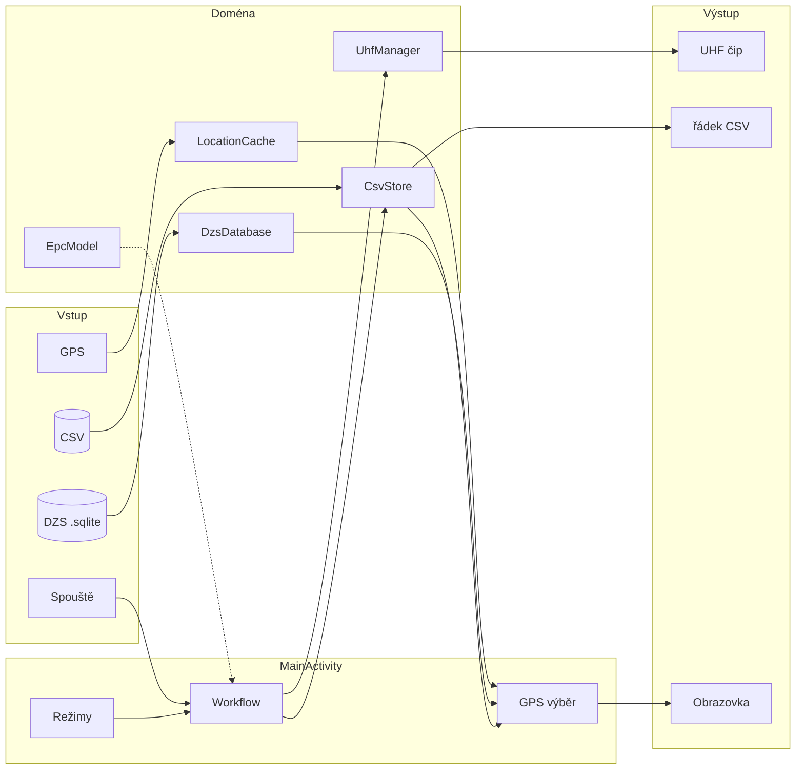
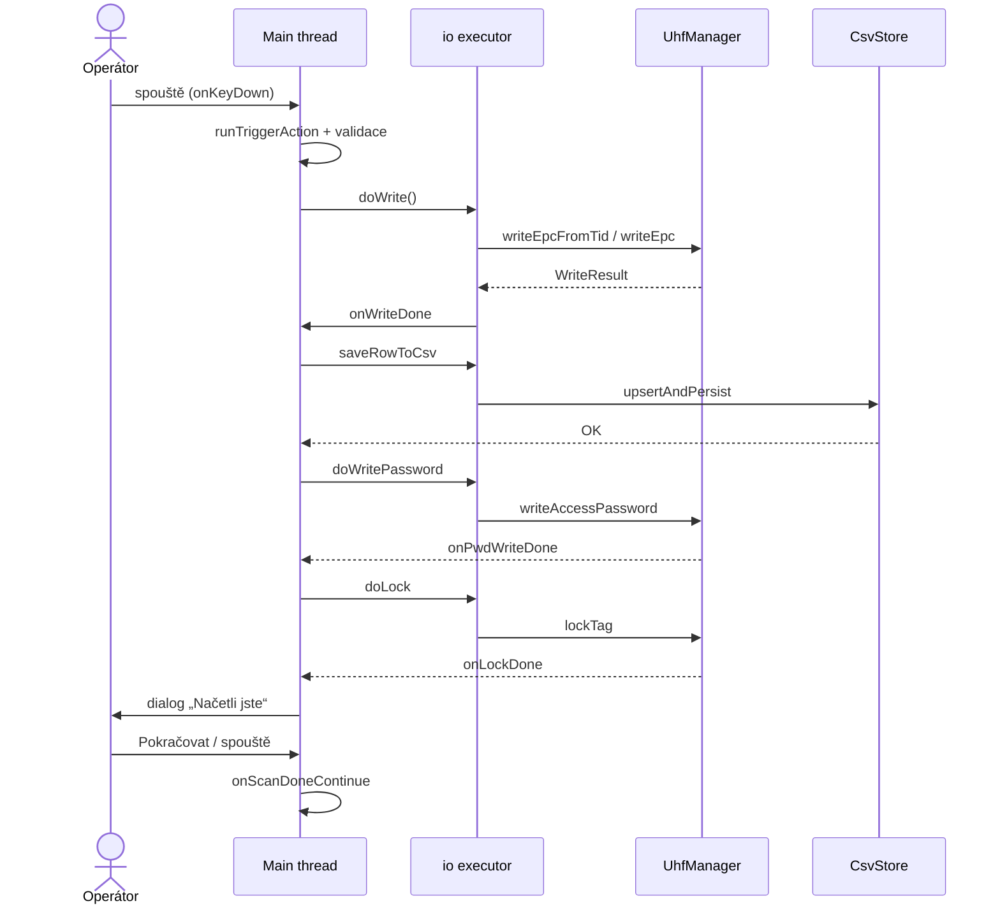
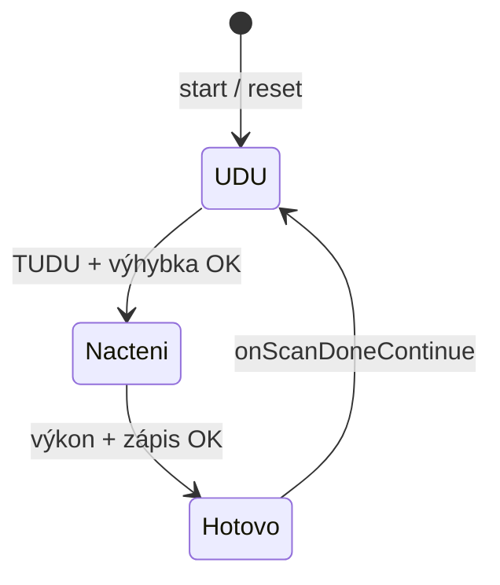
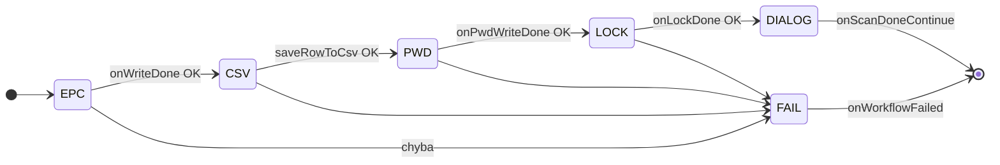
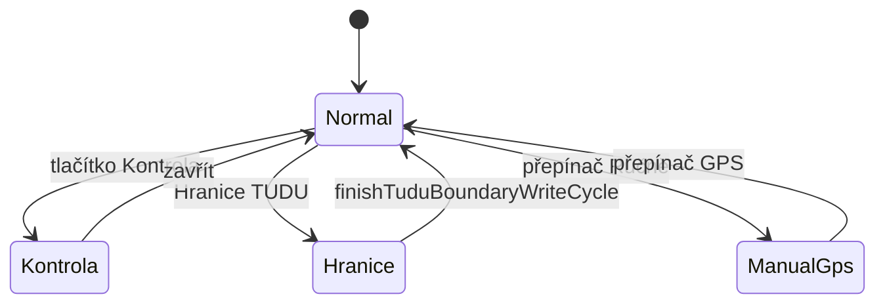
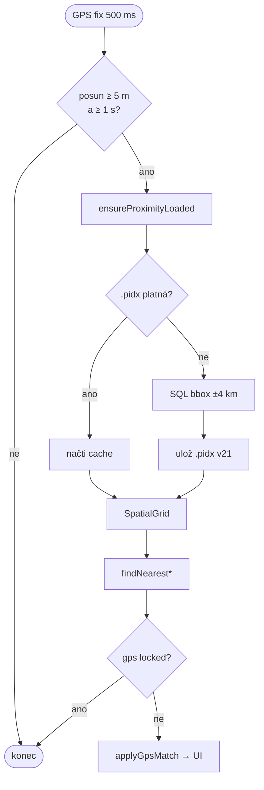
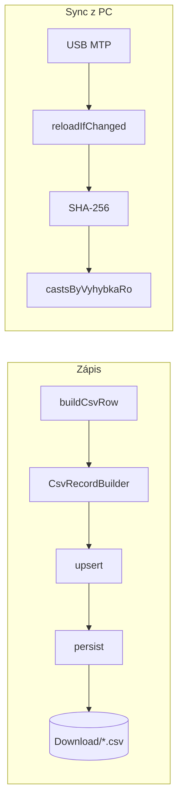
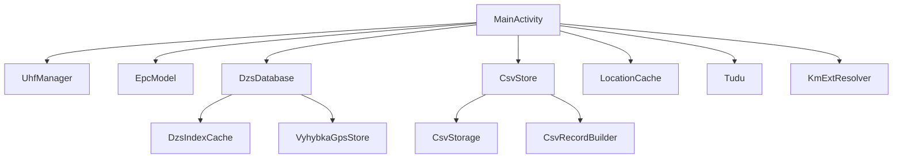

# RFID Go GPS – Technická příručka pro vývojáře

**Verze aplikace:** 3.154  
**Package:** `com.rfidw.app` · `applicationId` `com.rfidw.app.gps`  
**Zařízení:** Chainway C5 (UHF UART, RSCJA SDK)

> **Formáty:** Markdown (zdroj) · [PDF](RFID_Go_GPS_prirucka_vyvojare.pdf) · [HTML s Mermaid](prirucka-vyvojare.html)  
> V PDF jsou Mermaid bloky nahrazené odkazem na tabulku/ASCII níže. V HTML a na GitHubu se vykreslí barevně.

---

## Obsah

| # | Kapitola | Kdy číst |
|---|----------|----------|
| 0 | [Jak číst](#0-jak-číst-tuto-příručku) | vždy první |
| 1 | [Velký obraz](#1-velký-obraz) | orientace |
| 2 | [Anatomie jednoho zápisu](#2-anatomie-jednoho-zápisu) | nejdůležitější kapitola |
| 3 | [Stavové automaty](#3-stavové-automaty) | UI / workflow stavy |
| 4 | [Datové toky](#4-datové-toky) | start, GPS, DZS, CSV |
| 5 | [Vlákna](#5-vlákna-a-souběžnost) | co smí kam |
| 6 | [Režimy](#6-režimy-aplikace) | Kontrola, hranice, ruční |
| 7 | [MainActivity – mapa souboru](#7-mainactivity--mapa-souboru) | navigace v 5600 řádcích |
| 8 | [Karty tříd](#8-karty-tříd) | API modulů |
| 9 | [Debug](#9-kde-hledat-při-problému) | ladění |
| A | [Cheat sheet](#příloha-cheat-sheet) | rychlá reference |

---

## 0. Jak číst tuto příručku

### 0.1 Tři úrovně

```
ÚROVEŇ 1 – Orientace          kap. 1 + 2 + Příloha
ÚROVEŇ 2 – Konkrétní scénář   kap. 3–6 (vyber téma)
ÚROVEŇ 3 – Implementace       kap. 7–9 (otevři IDE)
```

### 0.2 Kam jít podle otázky

| Ptám se… | Jdi sem |
|----------|---------|
| Co přesně se stane po spoušti? | [2 Anatomie zápisu](#2-anatomie-jednoho-zápisu) |
| Kde v `MainActivity` to najdu? | [7 Mapa souboru](#7-mainactivity--mapa-souboru) |
| Proč UI blokuje / čeká? | [3 Stavy](#3-stavové-automaty) |
| Jak se vybere výhybka z GPS? | [4.2](#42-gps--výběr-výhybky) + [8.4](#84-dzsdatabase) |
| Jak funguje `.pidx`? | [4.3](#43-dzs-a-cache-pidx) |
| Proč CSV z PC „nejde“? | [4.4](#44-csv) + [9](#9-kde-hledat-při-problému) |
| Na jakém vlákně smím volat DB/RFID? | [5](#5-vlákna-a-souběžnost) |
| Kontrola / hranice TUDU? | [6](#6-režimy-aplikace) |

---

## 1. Velký obraz

### 1.1 Jedna věta

Aplikace **určí kontext výhybky** (GPS + DZS + CSV), **zapíše UHF tag** (EPC → heslo → lock) a **uloží řádek CSV** včetně GPS čtečky.

### 1.2 Plakát systému



**ASCII plakát (PDF):**

```
 ┌─────────┐     ┌──────────────────┐     ┌────────────┐     ┌──────────┐
 │ Spouště │────►│   MainActivity   │────►│ UhfManager │────►│ UHF čip  │
 │ GPS     │────►│  workflow+výběr  │────►│ DzsDatabase│────►│ .sqlite  │
 │ CSV/PC  │────►│  režimy          │────►│ CsvStore   │────►│ CSV file │
 └─────────┘     └──────────────────┘     │ EpcModel   │     │ UI       │
                                          │ Location…  │     └──────────┘
                                          └────────────┘
```

### 1.3 Velikost modulů (orientace v repu)

| Soubor | Řádků | Role |
|--------|------:|------|
| `ui/MainActivity.java` | ~5640 | orchestrátor – **všechno se tady spojuje** |
| `data/DzsDatabase.java` | ~1580 | SQLite, proximity, spatial grid |
| `csv/CsvStore.java` | ~600 | tabulka + index dokončených čipů |
| `data/Tudu.java` | ~450 | model TUDU / výhybka / RO |
| `data/DzsIndexCache.java` | ~370 | `.pidx` v21 |
| `rfid/UhfManager.java` | ~360 | obal UHF SDK |
| `location/LocationCache.java` | ~280 | GPS cache 500 ms |
| `epc/EpcModel.java` | ~180 | sestavení / validace EPC |
| ostatní | &lt;150 | CSV cesta, KmExt, adapter |

**Pravidlo:** logiku hledej v malých třídách; v `MainActivity` hledej **kdy** se volá.

---

## 2. Anatomie jednoho zápisu

Tato kapitola je **nejdůležitější**. Jeden úspěšný zápis od spouště po „Pokračovat“.

### 2.1 Časová osa (co se děje)

```
čas →

 MAIN ──► onKeyDown ──► runTriggerAction ──► validace ──┬── doWrite() ──┐
                                                        │               │
 IO   ──────────────────────────────────────────────────┴───────────────┤
                                                                        ▼
                                                              uhf.writeEpcFromTid
                                                                        │
 MAIN ◄─────────────────────────────────────────────── ui.post(onWriteDone)
        │
        ├── saveRowToCsv ──► (IO) upsertAndPersist ──► UI
        ├── doWritePassword ──► (IO) writeAccessPassword ──► onPwdWriteDone
        ├── doLock ──► (IO) lockTag ──► onLockDone
        └── dialog „Načetli jste“  (scanDoneAwaitingConfirm = true)
                │
                ▼ spouště / Pokračovat
           onScanDoneContinue → onTagCycleComplete → další čip
```

### 2.2 Krok za krokem – stavy paměti

| # | Metoda | Vlákno | Co se změní |
|:-:|--------|--------|-------------|
| 1 | `onKeyDown` | main | detekce trigger key |
| 2 | `runTriggerAction` | main | `chainWorkflow=true`, `workflowRunning=true`, `wfStepStates[EPC]=ACTIVE` |
| 3 | `doWrite` | main→io | volá `writeEpcFromTid` nebo `writeEpc` |
| 4 | `onWriteDone` | main | `wfStepStates[EPC]=OK`, spustí CSV |
| 5 | `saveRowToCsv` | main→io | řádek do `CsvStore` + soubor |
| 6 | `doWritePassword` | main→io | access heslo do tagu |
| 7 | `doLock` | main→io | lock `008020` |
| 8 | `onLockDone` | main | `step3Done=true`, dialog, `scanDoneAwaitingConfirm=true` |
| 9 | `onScanDoneContinue` | main | `onTagCycleComplete` (ID++, čip++), reset kroků |

### 2.3 Call stack při spoušti (zjednodušeně)

```
onKeyDown
 └─ runTriggerAction
     ├─ requirePowerPreset()          // Daleko 16 dBm / Blízko 1 dBm
     ├─ requireCastBranchSelection()  // Jazyk/Rovně/Odbočka u 3částové
     ├─ refreshGpsAtWorkflowStart()
     └─ doWrite()
         └─ io.execute → uhf.writeEpcFromTid(...)
             └─ ui.post → onWriteDone
                 ├─ saveRowToCsv → buildCsvRow → CsvRecordBuilder
                 ├─ doWritePassword → onPwdWriteDone
                 └─ doLock → onLockDone → showScanDoneNotification
```

### 2.4 Swimlane (Mermaid)



**Tabulka (PDF):**

| Fáze | Main | `io` |
|------|------|------|
| Trigger | `onKeyDown` → `runTriggerAction` | — |
| EPC | spustí `doWrite` | `uhf.writeEpcFromTid` |
| CSV | rozhodnutí | `csvStore.upsertAndPersist` |
| Heslo / Lock | callback řetězec | `writeAccessPassword` / `lockTag` |
| Konec | dialog + `onScanDoneContinue` | — |

### 2.5 Kde to je v kódu

| Krok | `MainActivity` ≈ řádek |
|------|------------------------:|
| `onKeyDown` | 5359 |
| `runTriggerAction` | 5323 |
| `doWrite` | 4525 |
| `onWriteDone` | 4568 |
| `saveRowToCsv` | 4738 |
| `buildCsvRow` | 4821 |
| `doWritePassword` | 4615 |
| `onPwdWriteDone` | 4646 |
| `doLock` | 4677 |
| `onLockDone` | 4703 |
| `onScanDoneContinue` | 2185 |
| `onTagCycleComplete` | 4961 |

> Řádky se posouvají s refaktoringem – hledej **název metody**, číslo je orientační.

---

## 3. Stavové automaty

### 3.1 Horní karty (UDU → Načtení → Hotovo)



| Krok | Flag | Splněno když |
|------|------|--------------|
| ① UDU | `step1Done` | TUDU + výhybka (nebo vyplněná hranice) |
| ② Načtení | `step2Done` | zvolený výkon (`activePowerPresetInKoleji != null`) |
| ③ Hotovo | `step3Done` | úspěšné zamčení |

### 3.2 Pod-workflow zápisu (4 kruhy)



| i | Konstanta | Akce | Callback |
|:-:|-----------|------|----------|
| 0 | `WF_STEP_EPC` | `doWrite` | `onWriteDone` |
| 1 | `WF_STEP_CSV` | `saveRowToCsv` | → `doWritePassword` |
| 2 | `WF_STEP_PWD` | `doWritePassword` | `onPwdWriteDone` |
| 3 | `WF_STEP_LOCK` | `doLock` | `onLockDone` |

`wfStepStates[i]`: `PENDING(0)` → `ACTIVE(1)` → `OK(2)` / `FAIL(3)`.

| Příznak | Význam |
|---------|--------|
| `chainWorkflow` | spouště spustilo celý řetězec |
| `workflowRunning` | zápis právě běží |
| `scanDoneAwaitingConfirm` | LOCK OK, čeká dialog |

### 3.3 Režimy (vzájemně se vylučují)



---

## 4. Datové toky

### 4.1 Start (`onCreate`)


| # | Co | Metoda |
|:-:|----|--------|
| 1 | UI + prefs | `onCreate`, `bindViews` |
| 2 | GPS | `LocationCache.start()` |
| 3 | CSV | `CsvStore` → `applyReloadedCsvState` |
| 4 | Auto DB | `tryAutoLoadDefaultDatabase` → Download/`DZS_PASPORT_TPI.sqlite` |
| 5 | Index | `loadDatabaseFromPath` na `gpsIo` |
| 6 | Lookup | `scheduleGpsTuduLookup` |

### 4.2 GPS → výběr výhybky



| Konstanta | Hodnota | Význam |
|-----------|---------|--------|
| `GPS_LOOKUP_MIN_MOVE_M` | 5 m | min. pohyb |
| `GPS_LOOKUP_MIN_INTERVAL_MS` | 1000 | throttle |
| `GPS_LOOKUP_TIMEOUT_MS` | 10 s | timeout lookupu |
| `PROXIMITY_BBOX_DEG` | 0,04 | ~4 km |
| `PROXIMITY_RELOAD_MOVE_KM` | 3 km | reindex při odjezdu |

### 4.3 DZS a cache `.pidx`

```
  DZS_PASPORT_TPI.sqlite
           │  kopie → files/dzs/
           ▼
     SHA-256 (sidecar hash2_*.txt)
           │
           ▼
  proximity index (bbox kolem GPS)
     ┌─────┴──────────────┐
     ▼                    ▼
 roByPairKey         VyhybkaGpsStore
     └────────┬───────────┘
              ▼
        SpatialGrid → GpsMatch → applyGpsMatch
```

| Tabulka SQLite | Klíčová data |
|----------------|--------------|
| `DZS_SUPER_RO_TPI` | TUDU, výhybka, POLOHA, RO_ID, OD, DO |
| `DZS_SUPERTRA_GPS_KM` | LAT, LON, KM_EXT, SUPER_Z/D_ID |

Detail: [`INDEXACE_DZS.md`](INDEXACE_DZS.md) *(část o plné indexaci je zastaralá – po auditu v3.141 jen proximity)*.

### 4.4 CSV



| Index | Klíč | Hodnota |
|-------|------|---------|
| řádky | `ID_RFID` | `CsvStore.Row` |
| dokončené čipy | `TUDU\0výhybka\0roId` | `Set&lt;Integer&gt;` castů |

Soubor: `Download/rfid_go_gps_output.csv` (`CsvStorage` – MediaStore na Android 10+).

### 4.5 Spouště – rozhodovací strom

```
              onKeyDown (trigger key)
                       │
         ┌─────────────┼─────────────┐
         ▼             ▼             ▼
   kontrolaActive  scanDoneConfirm  delete dialog
         │             │             │
         ▼             ▼             ▼
  runKontrolaRead  onScanDoneContinue  (ignorovat)
         │
         └──────────► runTriggerAction
                            │
                            ▼
                   EPC → CSV → PWD → LOCK
```

---

## 5. Vlákna a souběžnost

### 5.1 Tři executory

```
┌──────────────┐   ┌────────────────────┐   ┌────────────────────┐
│  main / ui   │   │  io                │   │  gpsIo             │
│  Handler     │   │  (1 vlákno)        │   │  (1 vlákno)        │
├──────────────┤   ├────────────────────┤   ├────────────────────┤
│ UI, validace │   │ UHF zápis/čtení    │   │ DzsDatabase.open   │
│ callbacky    │   │ CSV persist        │   │ ensureProximity…   │
│ dialogy      │   │ některé pickery    │   │ GPS lookup DB      │
└──────────────┘   └────────────────────┘   └────────────────────┘
```

### 5.2 Pravidla (povinná)

| Smí na main? | Operace |
|:------------:|---------|
| ✗ | RFID write/read (kromě `UhfManager.init()` při startu) |
| ✗ | SQLite / indexace DZS |
| ✗ | těžký CSV I/O (persist celého souboru) |
| ✓ | `ui.post` / `runOnUiThread` po dokončení I/O |
| ✓ | validace formuláře, dialogy, změna View |

**Proč dva executory:** RFID a SQLite nesmí blokovat sebe navzájem – GPS lookup běží na `gpsIo`, zápis tagu na `io`.

---

## 6. Režimy aplikace

| | **Normál** | **Kontrola** | **Hranice TUDU** | **Ruční GPS** |
|---|:---:|:---:|:---:|:---:|
| Zápis tagu | ✓ | ✗ | ✓ (čip 5) | ✓ |
| GPS auto-výběr | ✓ | — | ✗ | ✗ |
| Čte CSV | stav | porovnání | — | stav |
| `epc.cast` | 1–4 | — | **5** | 1–4 |
| POLOHA | z DB | — | prázdná | z DB |
| Metody | `runTriggerAction` | `runKontrolaRead` | `showTuduBoundaryForm` | `showTuduPicker` |

**Spouště v režimech:**

| Režim | Spouště |
|-------|---------|
| Normál | celý řetězec zápisu |
| Kontrola | `readSingle` + match CSV |
| Dialog „Načetli jste“ | = tlačítko Pokračovat |
| Delete confirm | spouště se ignoruje |

---

## 7. MainActivity – mapa souboru

`MainActivity.java` (~5640 řádků) je **jeden orchestrátor**. Níže mapa podle bloků – otevři soubor a skoč na oblast.

### 7.1 Mapa podle řádků

```
  130–270   pole, konstanty, prefs klíče
  271–390   onCreate, bindViews
  390–600   UI sheet, karty, collapsibles
  600–1320  pickery (TUDU, výhybka, nearby), hranice TUDU form
 1320–1800  GPS reload, workflow step indicators
 1800–2180  summary, cast hint, power presets
 2185–2230  onScanDoneContinue / Retry
 2567+      onWorkflowFailed
 3770–4100  loadDatabase*, scheduleGpsTuduLookup, applyGpsMatch
 4525–5000  doWrite / CSV / heslo / lock / onTagCycleComplete
 5218+      firstMissingCast, posun na další výhybku
 5323–5380  runTriggerAction, onKeyDown
 5397–5640  Kontrola overlay
```

### 7.2 Mapa podle úkolu

| Úkol | Metody |
|------|--------|
| Start | `onCreate`, `tryAutoLoadDefaultDatabase`, `loadDatabaseFromPath` |
| GPS | `scheduleGpsTuduLookup`, `applyGpsMatch`, `refreshGpsAtWorkflowStart` |
| Zápis | `runTriggerAction`, `doWrite`, `doWritePassword`, `doLock` |
| Po zápisu | `onWriteDone`, `onLockDone`, `onTagCycleComplete`, `onScanDoneContinue` |
| CSV | `saveRowToCsv`, `buildCsvRow`, `reloadCsvFromDiskIfChanged`, `firstMissingCast` |
| Pickery | `showTuduPicker`, `showVyhybkaPicker`, `showNearbyTuduPicker` |
| Kontrola | `showKontrolaOverlay`, `runKontrolaRead` |
| Hranice | `showTuduBoundaryForm`, `finishTuduBoundaryWriteCycle` |

### 7.3 Instance proměnné (seskupeno)

| Skupina | Proměnné |
|---------|----------|
| Kroky UI | `step1Done`, `step2Done`, `step3Done` |
| Workflow | `chainWorkflow`, `workflowRunning`, `wfStepStates[]`, `scanDoneAwaitingConfirm` |
| GPS | `gpsAutoSelection`, `gpsTuduLocked`, `gpsVyhybkaLocked`, `gpsTestMode` |
| Režimy | `kontrolaActive`, `tuduBoundaryMode`, `epcTemplateMode` |
| Kontext | `epc`, `currentTudu`, `currentVyhybka`, `castPartType` |
| Služby | `csvStore`, `dzsDatabase`, `uhf`, `locationCache` |

### 7.4 Závislosti MainActivity → doména



---

## 8. Karty tříd

Každá karta: **vstup → výstup → metody**.

### 8.1 EpcModel

| | |
|---|---|
| Soubor | `epc/EpcModel.java` (~180 ř.) |
| Vstup | `year`, `tudu`, `vyhybka`, `cast`, `idRfid` |
| Výstup | 24 hex EPC |
| Metody | `buildEpc()`, `decode()`, `isValid()` |
| Poznámka | čistá Java – testovatelná na JVM |

```
┌──────┬──────┬───┬───┬─────┬──┬──────────┐
│ ROK  │TUDU  │T5 │T6 │ VÝH │Č │ ID_RFID  │
│  4   │ 1-4  │ 2 │ 2 │  3  │1 │    8     │
└──────┴──────┴───┴───┴─────┴──┴──────────┘
 Příklad: 202615014A01010100030001
```

V terénu je výchozí **Šablona OFF** → EPC = TID (`writeEpcFromTid`).

### 8.2 Tudu

| | |
|---|---|
| Soubor | `data/Tudu.java` |
| Vstup | řádky DZS (`POLOHA`, `RO_ID`, OD/DO) |
| Výstup | TUDU → Výhybka → RoBranch |
| Metody | `uduCode()`, `findOrCreate()`, `resolvedCastMax()`, `fourPartFamily()` |

| POLOHA | Typ | Čipy | UI nápověda |
|--------|-----|------|-------------|
| `J*` | 3částová | 1–3 | Jazyk / Rovně / Odbočka |
| `C*` | 4částová | 1–4 | kódy sady (CA/CB, …) |

### 8.3 UhfManager

| | |
|---|---|
| Soubor | `rfid/UhfManager.java` |
| Vstup | access pwd, EPC 24 hex / TID |
| Výstup | `WriteResult` |
| Metody | `writeEpcFromTid()`, `writeAccessPassword()`, `lockTag()`, `readSingle()` |

| Banka | ptr | len | Účel |
|-------|-----|-----|------|
| EPC (1) | 2 | 6 | 24 hex |
| RESERVED (0) | 2 | 2 | access heslo |

Fallback hesel: `11223344`, `11112222`, `12345678`. Lock: `008020`.

### 8.4 DzsDatabase

| | |
|---|---|
| Soubor | `data/DzsDatabase.java` (~1580 ř.) |
| Vstup | cesta SQLite + GPS |
| Výstup | `GpsMatch`, `List&lt;Tudu&gt;` |
| Metody | `open()`, `ensureProximityLoaded()`, `findNearest*()`, `loadAllTudu()` |

### 8.5 DzsIndexCache

| | |
|---|---|
| Soubor | `data/DzsIndexCache.java` (package-private) |
| Formát | `.pidx` **v21**, gzip |
| Metody | `tryLoadProximity()`, `saveProximity()`, `resolveContentHash()` |

### 8.6 CsvStore / CsvStorage / CsvRecordBuilder

| Třída | Role |
|-------|------|
| `CsvStore` | in-memory tabulka, index čipů, legacy migrace |
| `CsvStorage` | cesta Download/, MediaStore Android 10+ |
| `CsvRecordBuilder` | factory řádku (odděleno od EpcModel) |

### 8.7 LocationCache

Interval **500 ms**, stale **30 s**. API: `getSnapshot()`, `setTestOverride()`, `formatStatusText()`.

### 8.8 KmExtResolver

`fromOdDoKmRef(od, do, kmRef)` → `chip1` = KM_REF, `other` = druhý konec.

---

## 9. Kde hledat při problému

| Symptom | Příčina | Kde |
|---------|---------|-----|
| Spouště nic nedělá | chybí výkon / větev 3částové | `runTriggerAction`, `requirePowerPreset`, `requireCastBranchSelection` |
| Špatná výhybka | stale GPS / zámek / cache | `applyGpsMatch`, `gpsVyhybkaLocked`, `.pidx` |
| DB se dlouho načítá | první index okolí | `DzsDatabase.open`, `ensureProximityLoaded` |
| CSV z PC se nenačte | hash / MediaStore / oprávnění | `reloadIfChanged`, `CsvStorage` |
| Zápis EPC selže | špatné heslo tagu | `writeDataWithPresetFallback` |
| Tag zamčen | lock z dřívějška | `lockTag`, preset hesla |
| Čip se neposune | dialog stále čeká | `scanDoneAwaitingConfirm`, `onScanDoneContinue` |
| Hranice TUDU špatná data | režim hranice | `saveTuduBoundaryRowToCsv` |
| UI „zamrzlé“ během zápisu | `workflowRunning` | počkat / `onWorkflowFailed` |

---

## Příloha: Cheat sheet

### Struktura balíčků

```
com.rfidw.app/
  ui/MainActivity.java          ← orchestrátor (~5640 ř.)
  epc/EpcModel.java
  data/{Tudu, DzsDatabase, DzsIndexCache, VyhybkaGpsStore}
  csv/{CsvStore, CsvStorage, CsvRecordBuilder}
  rfid/UhfManager.java
  location/LocationCache.java
  kmext/KmExtResolver.java
```

### SharedPreferences `rfidgogps`

`idRfid` · `epcTemplateMode` · `tuduModeGps` · `gpsTestMode` · `testLat/Lon` · `dbSourcePath/Uri/DisplayName`

### Trigger keys

`139, 280, 293, 311, 312, 522, 523, 0x3E8`

### Výkon

| UI popisek | dBm | Konstanta |
|------------|----:|-----------|
| **Daleko** | 16 | `POWER_PRESET_KOLEJI_DBM` |
| **Blízko** | 1 | `POWER_PRESET_RUCE_DBM` |

### CSV sloupce

`ID_RFID;EPC;TID;TUDU;OBJEKT;POZICE;POLOHA;RO_ID_1;RO_ID_2;KM_EXT;LAT;LON;ACCURACY_M;GPS DATE`

### Build a dokumentace

```bash
./gradlew assembleRelease
python3 docs/generate_prirucka_vyvojare.py        # PDF
python3 docs/generate_prirucka_vyvojare_html.py   # HTML + Mermaid
```

### Související docs

| Dokument | Účel |
|----------|------|
| `prirucka-teren.md` | terénní operátor |
| `prirucka-uzivatele.md` | uživatelská příručka |
| `prirucka-vyvojare.html` | **tato** příručka s vykresleným Mermaid |
| `INDEXACE_DZS.md` | DZS detail (část zastaralá) |
| `AGENTS.md` | build v Cursor Cloud |

---

*RFID Go GPS 3.154 – technická příručka pro vývojáře*
