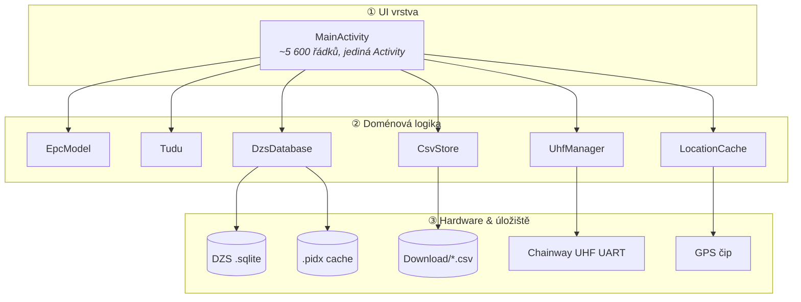
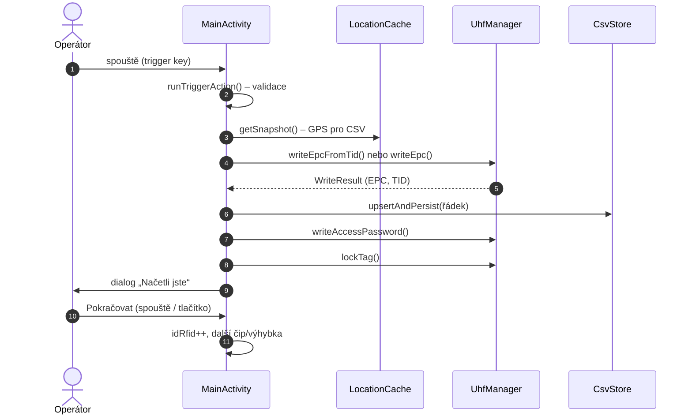
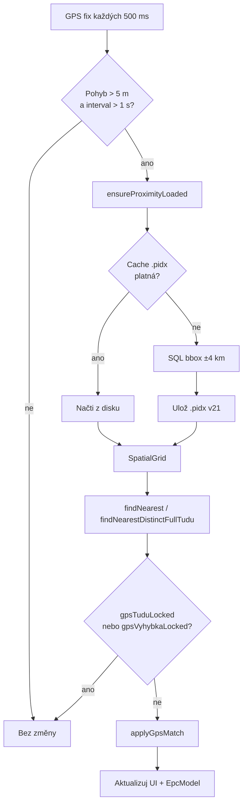
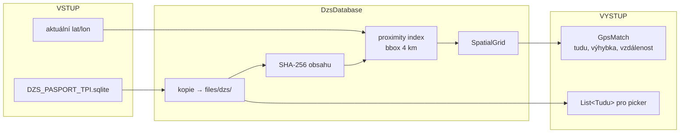
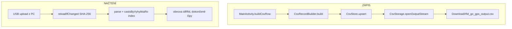
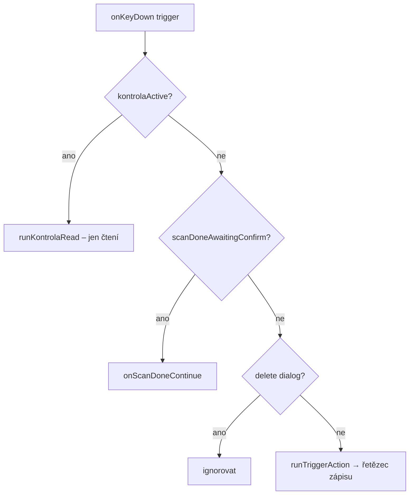
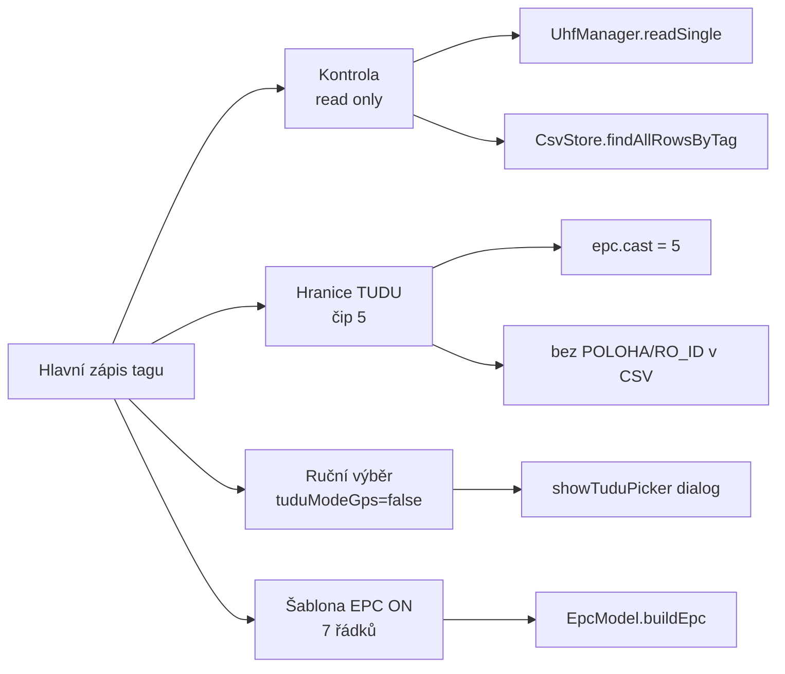

# RFID Go GPS – Technická příručka pro vývojáře

**Verze aplikace:** 3.153  
**Package:** `com.rfidw.app` / `applicationId` `com.rfidw.app.gps`  
**Cílové zařízení:** Chainway C5 (UHF UART, RSCJA SDK)

---

Třetí dokument v sadě – **výhradně pro vývoj a údržbu kódu**. Začněte **kapitolou 1 (datové toky)**; detailní reference tříd je v kapitolách 2–10.

> **Tip:** Diagramy `mermaid` se nejlépe zobrazí na GitHubu / v IDE. V PDF je pod každým diagramem **tabulkový ekvivalent**.

---

## 1. Datové toky – vizuální přehled

### 1.1 Tři vrstvy aplikace

Aplikace má jednoduché rozložení: **UI orchestruje**, **doménové třídy počítají**, **hardware a soubory persistují**.



| Vrstva | Komponenty | Odpovědnost |
|--------|------------|-------------|
| **① UI** | `MainActivity`, layout XML, `CsvAdapter` | workflow, indikátory, dialogy, spouště |
| **② Logika** | `EpcModel`, `Tudu`, `DzsDatabase`, `CsvStore`, `UhfManager`, `LocationCache` | výpočty, indexace, zápis tagu, CSV řádky |
| **③ I/O** | UHF SDK, GPS provider, SQLite, soubor CSV, `.pidx` | fyzický zápis, perzistence |

**Vlákna:** `io` (RFID + CSV), `gpsIo` (DB + GPS lookup), `ui` Handler (aktualizace obrazovky). RFID a SQLite **nikdy** na main thread.

---

### 1.2 Hlavní tok: zápis jednoho tagu

Nejčastější scénář – operátor stiskne spouště a proběhne celý řetězec.



| Krok | Kdo | Metoda | Výstup |
|:----:|-----|--------|--------|
| 1 | Operátor | spouště C5 | `onKeyDown()` |
| 2 | MainActivity | `runTriggerAction()` | validace výkonu, větve, EPC |
| 3 | LocationCache | `getSnapshot()` | LAT/LON/accuracy → CSV |
| 4 | UhfManager | `writeEpcFromTid()` * | nové EPC = TID (24 hex) |
| 5 | CsvStore | `upsertAndPersist()` | řádek v `rfid_go_gps_output.csv` |
| 6 | UhfManager | `writeAccessPassword()` | heslo `12345678` (výchozí) |
| 7 | UhfManager | `lockTag("008020")` | tag zamčen |
| 8 | MainActivity | dialog + `onScanDoneContinue()` | `idRfid++`, posun čipu |

\* Při `epcTemplateMode = true` krok 4 volá `writeEpc()` s `EpcModel.buildEpc()`.

**Stavové příznaky během řetězce:**

```
chainWorkflow = true
wfStepStates:  EPC → CSV → PWD → LOCK
               (každý: PENDING → ACTIVE → OK/FAIL)
scanDoneAwaitingConfirm = true   ← po úspěšném LOCK, čeká na potvrzení
```

---

### 1.3 Tok GPS → automatický výběr výhybky



| Fáze | Třída | Co se děje |
|------|-------|------------|
| Sběr polohy | `LocationCache` | GPS preferován před sítí; stale po 30 s |
| Throttle | `MainActivity` | min. 5 m pohyb, 1 s mezi lookupy |
| Index okolí | `DzsDatabase` | bbox ±0,04° (~4 km); reload po 3 km |
| Cache | `DzsIndexCache` | `.pidx` gzip, verze 21, SHA-256 DB |
| Hledání | `SpatialGrid` | prstence 0,005° buňky, haversine |
| Aplikace | `applyGpsMatch()` | `currentTudu`, `currentVyhybka`, `epc.*` |

**Zámky:** ruční výběr TUDU → `gpsTuduLocked`; ruční výhybka → `gpsVyhybkaLocked`.

---

### 1.4 Tok DZS databáze (otevření → lookup)



**SQLite tabulky:**

| Tabulka | Obsah |
|---------|-------|
| `DZS_SUPER_RO_TPI` | TUDU, výhybka, POLOHA, RO_ID, OD/DO |
| `DZS_SUPERTRA_GPS_KM` | GPS body, KM_EXT |

**Klíče v paměti:** `pairKey = SUPER_Z_ID|SUPER_D_ID`, `roKey = pairKey|RO_ID`.

---

### 1.5 Tok CSV (zápis a synchronizace)



| Operace | Metoda | Poznámka |
|---------|--------|----------|
| Sestavení řádku | `CsvRecordBuilder.build(...)` | odděleno od EpcModel |
| Upsert | `CsvStore.upsertAndPersist()` | klíč = `ID_RFID` |
| Detekce změny | `reloadIfChanged()` | SHA-256 celého souboru |
| Index čipů | `castsByVyhybkaRo` | `TUDU\0výhybka\0roId` → Set čipů |
| Android 10+ | `CsvStorage` MediaStore | `IS_PENDING` → publish pro MTP |

---

### 1.6 Spouště – rozhodovací strom



| Kontext | Akce spouště |
|---------|--------------|
| Režim **Kontrola** | `readSingle()` → hledání v CSV |
| Dialog **„Načetli jste“** | potvrzení, posun na další čip |
| **Normální provoz** | EPC → CSV → heslo → lock |

Trigger key codes: `139, 280, 293, 311, 312, 522, 523, 0x3E8`.

---

### 1.7 Speciální režimy (odbočky od hlavního toku)



---

### 1.8 EPC – vizuální layout (24 hex znaků)

```
┌────────┬────────┬────┬────┬─────┬───┬──────────┐
│  ROK   │ TUDU   │T5  │T6  │VÝH. │Č. │ ID_RFID  │
│ 4 zn.  │ 1–4    │2 zn│2 zn│3 zn│1  │ 8 zn.    │
├────────┼────────┼────┼────┼─────┼───┼──────────┤
│ 2026   │ 1501   │ 4A │ 01 │ 010 │ 1 │00030001  │
└────────┴────────┴────┴────┴─────┴───┴──────────┘
         └─ TUDU 1501J1 ─┘      výh.10  čip1
```

Implementace: `epc/EpcModel.java` – čistá Java, testovatelná na JVM.

---

### 1.9 Doménový model Tudu (hierarchie)

```
Tudu "1501J1"
 │
 └── Vyhybka cislo=10, iob="A"
      ├── castMin=1, castMax=3|4
      └── RoBranch[]
           ├── roId, poloha (JA / CA …)
           ├── kmExtChip1  ← čip 1
           └── kmExtOther  ← čipy 2+
```

| POLOHA | Typ výhybky | Čipy |
|--------|-------------|------|
| `J*` | 3částová | 1–3 (jazyk / rovně / odbočka) |
| `C*` | 4částová | 1–4 (CA/CB, CG/CH, …) |

---

## 2. Architektura – struktura balíčků

```
app/src/main/java/com/rfidw/app/
├── ui/MainActivity.java       orchestrátor
├── ui/CsvAdapter.java
├── epc/EpcModel.java
├── data/Tudu.java, DzsDatabase.java, DzsIndexCache.java, VyhybkaGpsStore.java
├── csv/CsvStore.java, CsvStorage.java, CsvRecordBuilder.java
├── rfid/UhfManager.java
├── location/LocationCache.java
└── kmext/KmExtResolver.java
```

### SharedPreferences (`rfidgogps`)

| Klíč | Význam |
|------|--------|
| `idRfid` | další pořadové č. tagu (min. 400) |
| `epcTemplateMode` | šablona EPC ON/OFF |
| `tuduModeGps` | GPS auto vs ruční |
| `gpsTestMode`, `testLat`, `testLon` | simulace GPS |
| `dbSourcePath`, `dbDisplayName`, `dbSourceUri` | poslední DB |

---

## 3. MainActivity – workflow detail

> Tok zápisu a GPS viz **kapitola 1.2–1.3**. Zde jen doplňující detaily.

### 3.1 Kroky UI (indikátor nahoře)

| Krok | Flag | Podmínka |
|------|------|----------|
| UDU | `step1Done` | TUDU + výhybka, nebo hranice TUDU |
| Načtení | `step2Done` | zvolen preset výkonu |
| Hotovo | `step3Done` | úspěšné zamčení |

### 3.2 Post-cyklus

`onTagCycleComplete()` → `idRfid++` → `advanceCastAndVyhybka()` → `firstMissingCast()` (hledá mezery v CSV).

### 3.3 Hranice TUDU (čip 5)

`CAST_TUDU_BOUNDARY = 5`. Dialog `showTuduBoundaryForm()` → `tuduBoundaryMode`, GPS vypnuto, CSV bez POLOHA/RO_ID.

---

## 4. EpcModel – reference

| Segment | Znaky | Kódování |
|---------|-------|----------|
| rok | 4 | literál |
| TUDU 1–4 | 4 | uppercase |
| TUDU 5 | 2 | ASCII hex (`J`→`4A`) |
| TUDU 6 | 2 | číslice `%02d`, jinak ASCII hex |
| výhybka | 3 | `%03d` mod 1000 |
| část | 1 | hex mod 16 |
| ID_RFID | 8 | `%08d` mod 10⁸ |

API: `buildEpc()`, `buildEpcPreview()`, `isValid()`, `decode(epc24)`.

---

## 5. DZS indexace – reference

Detailní popis (část zastaralá): `docs/INDEXACE_DZS.md`. Aktuální model od v3.141: **jen proximity okolí**, ne plná DB.

### SpatialGrid

- Buňka `0,005°` (~550 m), max 40 prstenců
- Early stop při dostatečné vzdálenosti

### Formát `.pidx` v21

```
MAGIC | VERSION | dbSize | SHA-256 | centerLat/Lon
→ roCount × (pairKey, tudu, výhybka, iob, roId, castMin/Max, poloha, kmExt…)
→ gpsCount × (pairKey, tudu, výhybka, lat, lon, roId, poloha)
```

Platnost: hash DB + střed cache ≤ 3 km od GPS.

---

## 6. CSV – reference

Hlavička: `ID_RFID;EPC;TID;TUDU;OBJEKT;POZICE;POLOHA;RO_ID_1;RO_ID_2;KM_EXT;LAT;LON;ACCURACY_M;GPS DATE`

Legacy formáty: auto-detekce z hlavičky (`LEGACY_WITH_ROK`, `LEGACY_NO_POLOHA`, …).

---

## 7. UhfManager – reference

| Banka | ptr | len | Účel |
|-------|-----|-----|------|
| EPC (1) | 2 | 6 wordů | 24 hex EPC |
| RESERVED (0) | 2 | 2 wordy | access heslo |

Preset hesla při selhání: `11223344`, `11112222`, `12345678`. Lock code: `008020`.

Výkon: **v koleji** 16 dBm, **v ruce** 1 dBm.

---

## 8. LocationCache & KmExtResolver

**LocationCache:** GPS 500 ms, síť 2000 ms, stale 30 s, recent 15 s.

**KmExtResolver:** `fromOdDoKmRef(od, do, kmRef)` → `chip1` = KM_REF, `other` = druhý konec OD/DO.

---

## 9. Build a nasazení

| Parametr | Hodnota |
|----------|---------|
| compileSdk / targetSdk | 34 |
| minSdk | 21 |
| Java | 17 |
| ABI | armeabi-v7a, arm64-v8a |

`./gradlew assembleRelease` → `rfid_go_gps_<verze>.apk`. CI: `.github/workflows/android.yml`.

Vývoj v Cursor Cloud: `AGENTS.md` (JDK 17, Android SDK).

---

## 10. Mapa metod MainActivity

| Oblast | Metody |
|--------|--------|
| Lifecycle | `onCreate`, `onResume`, `onPause`, `onDestroy` |
| DB | `loadDatabaseFromPath`, `tryAutoDiscoverDatabase` |
| GPS | `scheduleGpsTuduLookup`, `applyGpsMatch` |
| Zápis | `runTriggerAction`, `doWrite`, `doWritePassword`, `doLock` |
| Callbacks | `onWriteDone`, `onPwdWriteDone`, `onLockDone`, `onTagCycleComplete` |
| CSV | `saveRowToCsv`, `buildCsvRow`, `reloadCsvIfChanged` |
| Kontrola | `showKontrolaOverlay`, `runKontrolaRead` |
| Hranice | `showTuduBoundaryForm`, `finishTuduBoundaryWriteCycle` |
| Trigger | `onKeyDown` |

---

## 11. Známá omezení

| Položka | Stav |
|---------|------|
| Unit testy | chybí (`app/src/test`) |
| Hromadné smazání CSV | jen `removeLast()` |
| Export XLSX | ne |
| `INDEXACE_DZS.md` | popis plné `.idx` zastaralý |

---

## 12. Související dokumenty

| Dokument | Účel |
|----------|------|
| `prirucka-teren.md` | terén |
| `prirucka-uzivatele.md` | uživatel |
| `prirucka-vyvojare.md` | **tento dokument** |
| `INDEXACE_DZS.md` | detail DZS |

**PDF:** `python3 docs/generate_prirucka_vyvojare.py`

---

*Technická příručka – RFID Go GPS 3.153*
